# RSA Production CI/CD — Pipeline, Downtime & Evidence

Prepared 27 Aug 2026 · RoadSide backend (`apac-booking-modernization-backend`) · AWS ap-southeast-1

---

## 1. Overview

Production deployments for the RSA (RoadSide Assistance) backend are fully automated through AWS
CodePipeline, with a mandatory human approval gate before anything touches the servers. A deployment
is triggered **only** by pushing a git tag of the form `prod/YYYYMMDD_NN` — merging or pushing
branches never deploys anything.

```mermaid
flowchart TD
    DEV["Developer pushes git tag<br/>prod/YYYYMMDD_NN"] --> SRC

    subgraph PIPE["AWS CodePipeline — roadside-backend-production"]
        SRC["Source<br/>Bitbucket · branch roadside-release-production<br/>(tag-triggered only)"] --> BUILD["Build<br/>CodeBuild · ~5–20 min"]
        BUILD --> GATE{"Manual Approval<br/>a human picks the moment"}
        GATE -- reject --> STOP(["Nothing deployed"])
        GATE -- approve --> DEPLOY["Deploy<br/>CodeDeploy → AspireAPAC_Production"]
    end

    DEPLOY --> PS["deploy-sites.ps1"]

    subgraph SRV["Production server — deploy window 71–83 s"]
        PS --> BK["1 · Backup both sites to<br/>C:&#92;RoadSide-Backup&#92;yyyy.MM.dd.HH.mm"]
        BK --> CP["2 · robocopy /E — copy only, never delete<br/>Web.config + App_Data excluded"]
        CP --> VF["3 · Verify Web.config SHA-256 unchanged<br/>(mismatch fails the deployment)"]
        VF --> RS["4 · IIS restart — user-visible blip: seconds"]
    end

    RS --> LIVE(["RoadSide admin + RoadSidePartner live"])
    BK -. rollback = restore this folder + iisreset .-> LIVE
```

Deployed sites: `RoadSide` (admin web, `C:\RoadsideWebAdminProduction`) and
`RoadSidePartner` (`C:\RoadSideWebPartnerProduction`).

## 2. Safety mechanisms

| Mechanism | Detail |
|---|---|
| Manual approval gate | The pipeline builds and then **stops**. Operations chooses the deploy moment (off-peak, after DB scripts, etc.). Rejecting the gate = nothing happened. |
| Pre-deploy site backup | Before copying a single file, the deploy script snapshots **both complete sites** (including `Web.config`) to `C:\RoadSide-Backup\yyyy.MM.dd.HH.mm`. Rollback = copy that folder back. Keep-10 rotation; manually created backups are never touched. |
| Copy, never delete | `robocopy /E` (not `/MIR`) — the deploy adds/updates build output and **never deletes** server content. Server-owned folders (`Config`, `Log`, upload dirs) survive by construction. |
| `Web.config` untouchable | Excluded from the copy entirely (`/XF`), backed up separately, and **SHA-256 verified unchanged** after the deploy — a changed hash fails the deployment. |
| `App_Data` untouchable | Excluded (`/XD`). |
| Fail loud | Any robocopy exit ≥ 8 throws and fails the deployment rather than half-copying. Leftover files not in the build are listed in the log for visibility. |
| Database discipline | DB changes run **before** the app deploy and are additive/widening only, verified safe with the old application still live (EF database-first performs no runtime schema validation; explicit column lists make added columns invisible to the old build). |
| Instance-level safety net | Named RDS snapshot before each release + 7-day point-in-time recovery on `rsa-prod`. |

## 3. Downtime

**User-visible downtime per deployment: a few seconds** — the IIS application-pool recycle while
binaries swap. The full CodeDeploy window (backup + copy + verify + restart) is **71-83 seconds**,
during which the sites keep serving until the final restart moment.

Measured on the three production deployments of 27 Aug 2026:

| Deployment | Start | Complete | Window |
|---|---|---|---|
| d-XCFCUOMK8 (release v21.01, tag `prod/20260827_03`) | 13:29:38 | 13:31:01 | **83 s** |
| d-I8A5JKUUK (hotfix, tag `prod/20260827_04`) | 14:28:39 | 14:29:52 | **73 s** |
| d-3AZ2YFVUK (hotfix, tag `prod/20260827_05`) | 15:05:18 | 15:06:29 | **71 s** |

Continuity evidence: after the 00:59 test deployment, the application event log shows live user
logins and dispatcher activity at 01:04 with **zero post-deploy system exceptions** — users worked
through the deployment without interruption beyond the restart blip.

## 4. Rollback — three layers, one of them proven live

1. **Application files** — restore the pre-deploy backup folder + `iisreset`.
   **Proven in production on 27 Aug**: the 00:59 test deployment was fully reverted in
   ~4 minutes (01:10-01:14) via a single scripted restore; zero errors afterward.
2. **Database** — release-specific rollback script restores the affected data and view
   definitions from the `bak` schema captured pre-deploy (additive columns deliberately remain —
   the old application is proven compatible with them).
3. **Catastrophe** — named RDS snapshot (`rsa-prerelease-*`) or point-in-time restore to any
   second within 7 days (restores to a new instance).

## 5. Evidence — pipeline history, 27 Aug 2026

All four production pipeline executions succeeded end-to-end:

| Execution | Started | Finished | Purpose |
|---|---|---|---|
| `4e511115` | 00:50 | 00:59 | Full dress-rehearsal deploy (tag `prod/20260827_02`), then deliberately reverted — proved pipeline, deploy safety rails, DB scripts and rollback in production |
| `36a4b5d8` | 11:24 | 13:31 | **Release v21.01** (`prod/20260827_03`) — build ready ~11:45, held at the approval gate until the 13:00 release window |
| `a5d171af` | 14:24 | 14:30 | Hotfix (`prod/20260827_04`) |
| `0bdac2b4` | 15:00 | 15:06 | Hotfix (`prod/20260827_05`) — final state |

Points worth noting to management:

- **Three production deployments in one afternoon, all zero-incident** — demonstrates the pipeline
  turns a production fix into a ~30-minute, low-risk routine (build ≈ 5-20 min, deploy ≈ 80 s).
- **The approval gate decouples "ready" from "live"**: the release build waited ~1.5 h at the gate
  until the agreed 13:00 window, with no pressure on the operator.
- **The dress rehearsal (00:50-01:14) validated the entire cycle including rollback** before the
  real release — deploy, verify, revert, all against the live production environment, users
  unaffected throughout.
- Database preparation was executed entirely **ahead of the deploy window with zero user impact**
  (all changes additive/widening; the one-off data migration originally planned was cancelled by
  ABE-5355, removing the only long-running step).

## 6. Standard release procedure (summary)

1. DB scripts (additive, pre-verified) run ahead of time — old app unaffected.
2. Push release branch → tag `prod/YYYYMMDD_NN` → pipeline builds and holds.
3. Named RDS snapshot taken (minutes, incremental, no outage).
4. Approve at the agreed window → ~80-second deploy → verification checklist
   (event log, key screens, smoke queries).
5. Rollback at any point: reject the gate (no-op) or restore the dated backup folder.

Full operational detail: `docs/RELEASE-28AUG-2026.md` and
`DatabaseScript/Release-28Aug-2026/RUN-ORDER.md` in the repository.
