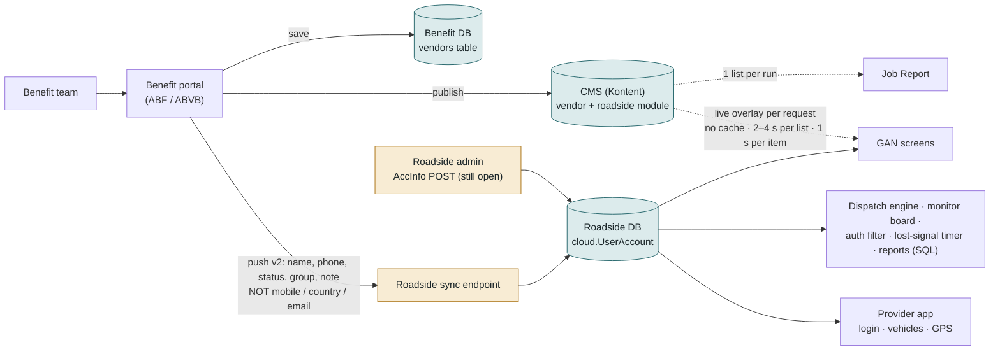
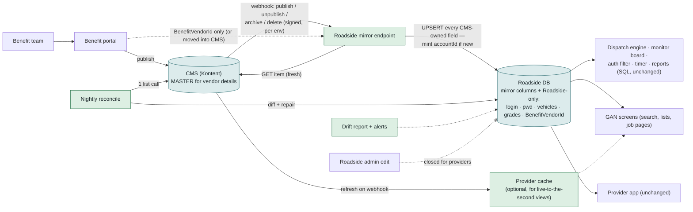
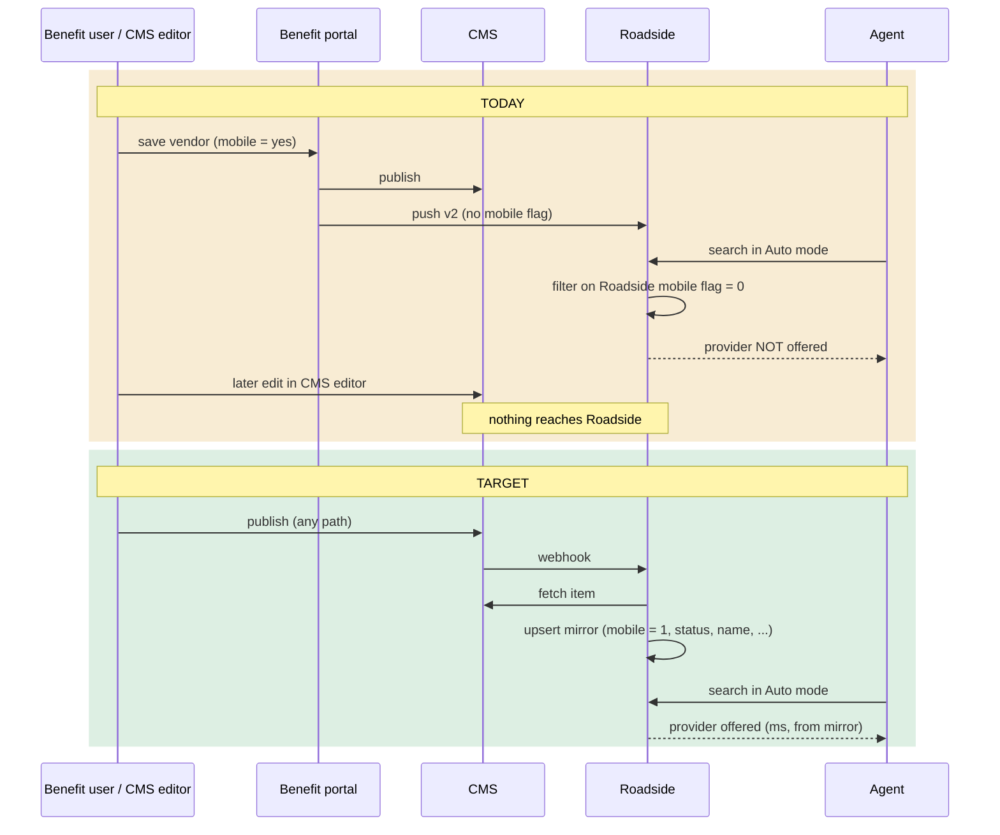

# 07 — Architecture changes needed

The target is **CMS as the master, Roadside as an always-complete mirror**. This is the only design in which every feature in documents 01–06 keeps working *and* users get the "one source of truth" experience. Fourteen changes, each with what it is, why, pros, cons, effort and risk.

Effort scale: **S** = days, **M** = 1–3 weeks, **L** = more than 3 weeks or cross-team. Risk = what goes wrong if it is skipped or done badly.

---

## How the pieces fit

### Today — three copies, two writers into Roadside, live CMS calls from screens

Amber = where the copies drift: a partial push, and a second writer behind the CMS's back. Dotted = live CMS calls on the request path with no cache.

### Target — CMS is the only writer; Roadside is a complete mirror; reads are local

Green = new. The portal no longer pushes vendor details; the CMS itself tells Roadside what changed; every read is local; the only path into the provider record is the mirror.

### Workflow — a vendor edit, today vs target

Field ownership (the rule behind everything below):

| Field | Owner | Roadside may write it? |
|---|---|---|
| Name, status, mobile vendor, group, country, phone, email, note, "is roadside provider" | CMS | Only the mirror |
| Roadside ID, login, password, vehicles, GPS, grades, job history | Roadside | Yes |
| CMS item ID (the link) | CMS | Written once by the mirror |
| Benefit vendor ID | Benefit portal | Only the sync |

---

## A · Make the CMS the only writer

### 1. Close the direct provider edit in Roadside
**What.** The provider save API still accepts name / contact / group / Active for provider accounts even though the screen is read-only. Reject those fields for `1-` / `2-` accounts; keep the API for staff accounts and keep password reset.
**Why.** Two writers guarantee drift. This is the second source of the current mismatch.
**Pros.** One truth; removes a whole class of "who changed this?" incidents.
**Cons.** Emergency corrections (wrong phone at night) must go through the CMS and wait for publish + webhook. An emergency path, if wanted, must write to the CMS.
**Effort.** S. **Risk if skipped.** Drift returns; with no fallback it is now visible to agents.

### 2. Retire the v1 push, or make v1 and v2 share one code path
**What.** Two versions of the vendor push exist; v1 copies more fields than v2. Keep one complete implementation.
**Why.** The mobile-flag gap exists because v2 forgot fields v1 had.
**Pros.** One mapping to maintain and test.
**Cons.** Needs confirmation that nothing on the Benefit side still calls v1 (the v1 endpoints are still deployed).
**Effort.** S–M. **Risk if skipped.** The next field added to the CMS is forgotten in one of the two.

---

## B · Let the CMS drive Roadside

### 3. CMS → Roadside webhook
**What.** Configure the CMS to call Roadside when a vendor (or its roadside module) is published, unpublished, archived or deleted. Roadside pulls the item, maps it, upserts the mirror row. Idempotent: the same event twice is harmless. Signed, so only the right CMS environment can call the right Roadside environment.
**Why.** Today Roadside only hears about a vendor when the Benefit portal saves it. Edits made in the CMS editor, scheduled publishes and unpublishes never arrive. This is the difference between "the CMS is the master" as a slogan and as a mechanism.
**Pros.** Seconds-level freshness; no dependency on the portal's save flow; works for vendors created directly in the CMS.
**Cons.** New public endpoint to secure; webhooks can arrive out of order or twice (hence idempotency + reconcile); Kontent webhooks fire per item, so a bulk edit of 700 vendors is 700 calls.
**Effort.** M. **Risk if skipped.** The mirror is only as fresh as the last portal save — the current situation.

### 4. Complete the field mapping (and decide the Benefit vendor ID)
**What.** The mirror writes every CMS-owned field on create and update: name, login label, status → Active, mobile vendor → Mobile Provider, group, country, phone, email, note, roadside flag (change 8). The Benefit vendor ID either (a) keeps arriving from the portal push for that one field, or (b) is added to the CMS roadside module so the webhook path carries it too.
**Why.** Partial copies are the direct cause of 317 hidden providers.
**Pros.** Every screen that reads the mirror is automatically correct.
**Cons.** (b) is a CMS content-model change and a Benefit-portal change; (a) keeps a second path alive.
**Effort.** S for the mapping (ships now); M for (b).
**Risk if skipped.** Nothing else in this plan works.

### 5. Define unpublish / archive / delete
**What.** Explicit mapping: CMS status `inactive` → Active = 0; unpublished / archived → Active = 0 (record kept); deleted in CMS → Active = 0 + flagged for review; never physically delete a provider with jobs, vehicles or logins. Optionally: CMS-side warning when unpublishing a vendor that has open jobs.
**Why.** "Published" is a content-workflow state; "active" is an operational one. Without a rule, a vendor left in draft vanishes from open jobs while its trucks keep working.
**Pros.** Predictable; history preserved.
**Cons.** Editors need to learn that unpublishing has operational effect.
**Effort.** S (code) + agreement. **Risk if skipped.** Blank provider names on live jobs; orphaned history.

### 6. Nightly full reconciliation
**What.** A scheduled job lists every CMS roadside vendor (one list call), compares with the mirror, repairs differences, and creates mirror rows for vendors that never got one.
**Why.** Event-driven syncs drift over months (274 migrated rows never got a mobile flag). Reconciliation is the safety net.
**Pros.** Self-healing; also the migration tool for the initial backfill.
**Cons.** Must be careful about what "repair" means for Roadside-owned fields (never touch them) and for rows flagged for review.
**Effort.** S–M. **Risk if skipped.** Slow, silent drift.

### 7. Drift report and alerting
**What.** Daily report of vendors where CMS ≠ mirror, count of webhook failures, age of the last successful reconcile; alert when either fails. Today sync errors go to a log table nobody reads.
**Why.** The current drift went unnoticed for ten months because nothing measured it.
**Pros.** Problems seen in a day, not a year.
**Cons.** Someone has to own the report.
**Effort.** S. **Risk if skipped.** Repeat of today.

---

## C · Fix how the CMS describes a roadside vendor

### 8. An explicit "roadside provider" flag in the CMS
**What.** Add a yes/no field on the roadside module ("Dispatchable in Roadside"). Roadside reads that instead of matching the text of two category fields.
**Why.** Today a vendor is a roadside provider if its category text contains "Auto Services" *and* "Roadside Assistance". Five active towing companies are filed under "Towing Assistance" and are therefore invisible to every CMS read.
**Pros.** Deliberate, editable, auditable.
**Cons.** Content-model change; existing 752 vendors need the flag set (one-time script).
**Effort.** S (CMS) + S (code) + data pass. **Risk if skipped.** Vendors disappear whenever an editor picks a different sub-category.

### 9. One-time data clean-up in the CMS
**What.** (i) Confirm the mobile flag on the 687 vendors marked mobile — call centres and dealers should not be; (ii) re-file or flag the 24 active providers filed outside roadside; (iii) decide the 7 Roadside providers with no CMS record (create CMS items or retire them); (iv) remove "(Duplicate)" and test entries; (v) after (i)–(iv), backfill the mirror.
**Why.** Once the CMS is master, its mistakes become operational on the same day.
**Pros.** Clean start; the 317 come back into Auto mode correctly, not blindly.
**Cons.** Needs business time, not developer time; blocks the switch until done.
**Effort.** M (mostly business). **Risk if skipped.** Call centres offered as mobile technicians; towing companies missing.

---

## D · Make CMS reads fast and safe

### 10. A provider cache inside Roadside
**What.** In-memory copy of the CMS roadside vendor list (and per-vendor detail) with a short TTL (60 s) and invalidation from the webhook. All CMS reads in the web application go through it.
**Why.** No cache exists. One list is 2.2 MB and 2.4–4.3 s; the search box asks for it on every keystroke; the map asks for it per load plus one call per vehicle.
**Pros.** Millisecond reads; CMS request volume drops by orders of magnitude; short CMS outages are invisible.
**Cons.** New component; background timers (6.1) need their own access to it; the cache is, strictly, a fallback — which the premise says it does not want.
**Effort.** M. **Risk if skipped.** Every CMS-backed screen is seconds slow and throttling is likely.

### 11. Explicit outage behaviour
**What.** Decide and implement one of: (a) mirror is the fallback (recommended); (b) cache serves stale data with a visible "provider data may be out of date" banner; (c) no fallback — screens show a clear error, not blanks. Replace today's silent `null` returns with logged, surfaced errors either way.
**Why.** Today a failed CMS call returns nothing and screens quietly show blanks. "No fallback" must be a decision, not an accident.
**Pros.** Predictable behaviour during incidents.
**Cons.** (c) makes CMS availability equal to dispatch availability.
**Effort.** S–M. **Risk if skipped.** Silent blanks in production, impossible to diagnose.

### 12. Search on the mirror, not the CMS
**What.** Provider search box, hand-typed names on benefit jobs, impersonation and the provider list match against the mirror (CMS name + Roadside login + ID).
**Why.** The CMS list can only be searched by vendor name and only in memory after a full download; the mirror is searched inside the same database query dispatch already uses, by any field.
**Pros.** Instant; keeps login/ID search; no CMS dependency on the hot path.
**Cons.** Freshness is webhook-bound (seconds).
**Effort.** S. **Risk if skipped.** Seconds-per-keystroke search.

---

## E · Environments and rollout

### 13. One CMS environment per Roadside environment
**What.** Set the CMS environment ID explicitly on SIT, UAT, pre-prod and production; stop SIT and UAT sharing one CMS environment; lock each webhook to its own pair.
**Why.** SIT and pre-prod read production CMS by default today. With the CMS as master, that is a data-integrity risk, not just a confusing screen.
**Pros.** Safe testing; reproducible bugs.
**Cons.** Kontent environment cost; the four Roadside-authored content types must exist in every environment (a known gotcha).
**Effort.** S–M. **Risk if skipped.** Test data in production or production data rewritten from test.

### 14. Backfill and staged switch-over
**What.** Run the reconcile once over all providers (after change 9), compare, sign off; then move read paths to the mirror / cache one screen at a time, starting with screens already on the CMS; keep the overlay code until the drift report has been clean for an agreed period; only then remove fallbacks if the business still wants that.
**Why.** A big-bang switch with 317 known differences and 31 missing vendors would be visible to every agent on day one.
**Pros.** Each step reversible.
**Cons.** Longer calendar time.
**Effort.** M spread over phases. **Risk if skipped.** A bad day for dispatch.

---

## Summary table

| # | Change | Group | Effort | Ships alone? | Risk if skipped |
|---|---|---|---|---|---|
| 1 | Close direct provider edit | Only writer | S | yes | drift returns |
| 2 | Retire / unify v1 push | Only writer | S–M | yes | forgotten fields |
| 3 | CMS → Roadside webhook | CMS drives | M | needs 4, 5 | stale mirror |
| 4 | Complete field mapping | CMS drives | S | **yes — ship now** | nothing works |
| 5 | Unpublish / delete rules | CMS drives | S + decision | yes | blanks on live jobs |
| 6 | Nightly reconcile | CMS drives | S–M | yes | slow drift |
| 7 | Drift report + alerts | CMS drives | S | yes | repeat of today |
| 8 | Roadside flag in CMS | Vendor definition | S + data | needs 9 | vendors vanish |
| 9 | CMS data clean-up | Vendor definition | M (business) | yes | wrong vendors live |
| 10 | Provider cache | Fast + safe | M | yes | seconds-slow screens |
| 11 | Outage behaviour | Fast + safe | S–M + decision | yes | silent blanks |
| 12 | Search on mirror | Fast + safe | S | needs 4 | slow search |
| 13 | Env per env | Rollout | S–M | yes | cross-env damage |
| 14 | Backfill + staged switch | Rollout | M | needs all | bad day one |
