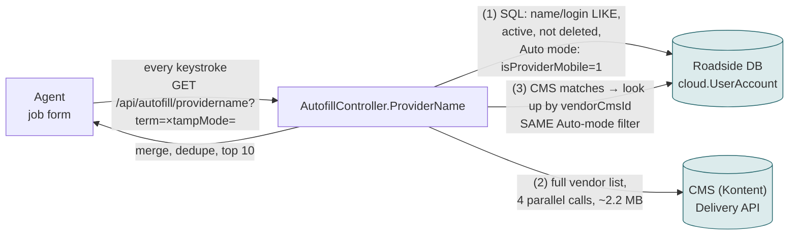
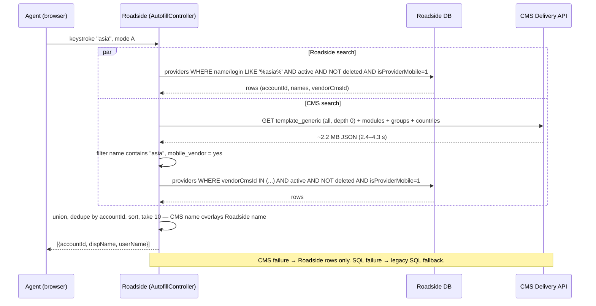
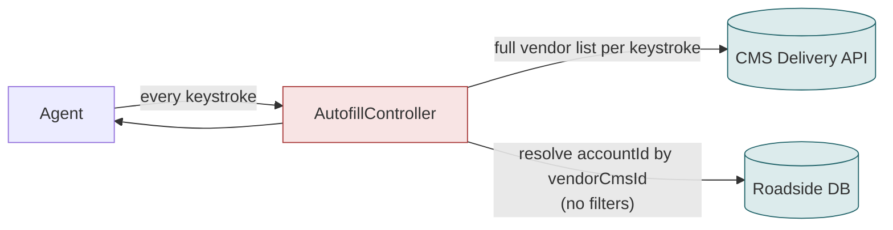
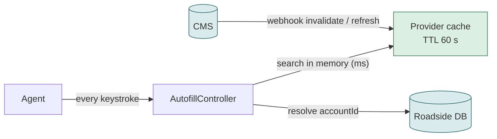
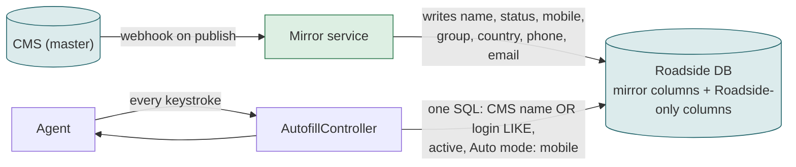
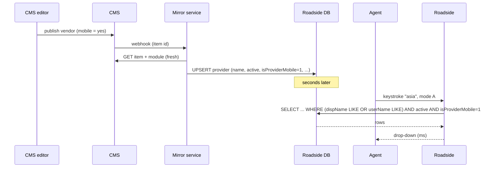

# F01 — Provider search box on the job form

**Area:** Dispatching a job · **Verdict:** Can move, with conditions · **Recommended:** search the Roadside mirror

> ### Quick view for managers
> **Verdict: Can move, with conditions**
>
> **Conditions to move** — all of these must be true first:
> 1. The Roadside copy carries the CMS mobile flag (the sync must write it — the ABE-5457 fix does this; then the one-off backfill of 317 providers).
> 2. The BA confirms who is really "mobile" in the CMS: 687 of 752 vendors are flagged mobile today, including call centres such as BMW / Toyota / Nissan Call Center.
> 3. The 24 vendors filed outside "Roadside Assistance" and the 7 with no CMS record are cleaned up in the CMS, or they disappear from the search box.
> 4. Search keeps matching on Roadside login as well as CMS name (agents type both).
> 5. If the CMS is read directly per keystroke: a cache first — a full CMS list takes 2–4 s and the box asks on every character.
>
> **What we get:** Every mobile provider appears in Auto-mode search; one spelling of every name; search stays instant.
>
> *Details, diagrams and the pros/cons of each option follow below.*

---

## 1. What it is

On the job form the agent types part of a provider's name and picks one from a drop-down. The pick stores the provider's Roadside ID on the job. In **Auto mode** (`tstampMethod = A`) only "mobile" providers are offered — those whose technicians use the app and can be tracked; in **Manual mode** any active provider is offered.

## 2. Who uses it and how often

Every agent, on every job. 13,622 jobs in 90 days ≈ 150 per day. The box fires a request on **every keystroke** and also on focus (`minLength: 0`), so 5–10 requests per job are normal: roughly **1,000 searches per day**.

## 3. Today

### 3.1 Architecture

### 3.2 Workflow

### 3.3 Data used

| Field | Read from | Used for |
|---|---|---|
| accountId | Roadside | value saved on the job |
| dispName, userName | Roadside (CMS name overlays if linked) | matching + display |
| active, isDelete | Roadside | gate |
| isProviderMobile | **Roadside** (Auto mode) | gate — **stale for 317 providers** |
| vendor_name, mobile_vendor, vendor_status | CMS | second matching path |

### 3.4 The defect today

Both branches gate on the Roadside `isProviderMobile`. The v2 sync never writes that column, so a vendor that is "mobile = yes" in the CMS is never offered in Auto mode. Asia Lue Garage (`2-0938`) is one of **317** such providers. Manual mode (no mobile gate) shows them, which is why the ticket says "only in Manual".

## 4. Option A — literal CMS-only, no fallback

### 4.1 Architecture

### 4.2 What the agent experiences

| Situation | Result |
|---|---|
| Normal keystroke | 2.4–4.3 s wait per character; fast typing queues several 2.2 MB downloads |
| Vendor mobile in CMS, not in Roadside | offered ✔ (fixes the 317) |
| Vendor filed outside "Roadside Assistance" (24 active) or no CMS record (7) | never offered ✘ |
| Agent types the Roadside login or a legacy spelling | no match ✘ |
| CMS slow / 429 / down | empty drop-down; **no dispatch possible** ✘ |

Load: ~1,000 searches/day × 2.2 MB ≈ **2.2 GB/day** of CMS traffic for a drop-down; likely to be throttled.

### 4.3 Pros / cons

| Pros | Cons |
|---|---|
| Exactly what the CMS editor sees, instantly after publish | Seconds per keystroke |
| No Roadside flag can be stale | Loses 31 providers; loses login / legacy-name matching |
| Simplest code | Dispatch stops during a CMS incident |
| | Gigabytes of daily CMS traffic; throttling risk |

## 5. Option B — CMS through an in-Roadside cache

| Pros | Cons |
|---|---|
| Milliseconds per keystroke | New component to build, warm, monitor |
| Fresh within a minute / on webhook | Same 31-provider and login-search losses as A unless CMS data is fixed |
| Survives short CMS outages (serves last good list) | The cache *is* a fallback — contradicts "no fallback" |

## 6. Option C — search the Roadside mirror (recommended)

### 6.1 Architecture

### 6.2 Workflow

### 6.3 Pros / cons

| Pros | Cons |
|---|---|
| 0 CMS calls per keystroke; instant | Freshness = webhook latency (seconds); not "live" |
| Keeps login / ID / legacy-name matching | Depends on the mirror being complete (change 4) and the webhook reliable (changes 3, 6) |
| Works during CMS outages | |
| Fixes the 317 the moment the mirror copies the mobile flag | |
| No new runtime component | |

## 7. Comparison

| | Today | A · CMS-only | B · Cache | C · Mirror |
|---|---|---|---|---|
| Latency per keystroke | 2.4–4.3 s (CMS path) | 2.4–4.3 s | ms | ms |
| CMS calls per day | ~1,000 lists | ~1,000 lists | ~1–100 | 0 |
| Offers the 317 hidden providers | no | yes | yes | yes (after mirror) |
| Offers the 31 outside CMS filter | yes | **no** | **no** | yes |
| Login-name search | yes | no | no | yes |
| Works during CMS outage | yes | **no** | mostly | yes |

## 8. Verdict

**Can move, with conditions.** Recommended **C**; **B** only if the business requires second-level freshness. **A** is not viable.

**Prerequisites:** mirror writes `isProviderMobile` (Phase 0); CMS mobile flag reviewed (687/752 flagged, incl. call centres); the 24 misfiled + 7 unlinked resolved if B is chosen.
**Effort:** C = S (after Phase 0) · B = M · A = S to write, unacceptable to run.
**Code:** `BkkRsa/Api/AutofillController.cs:49-146`, `Scripts/rsa/BkkRsa.Autofill.js:25`, `Views/Msu/Job.cshtml:2720`.
