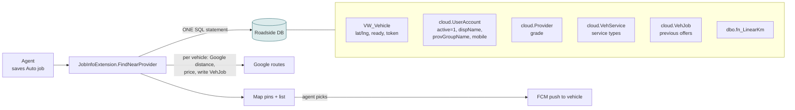
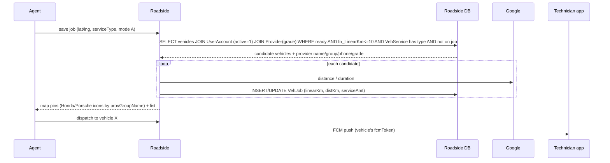
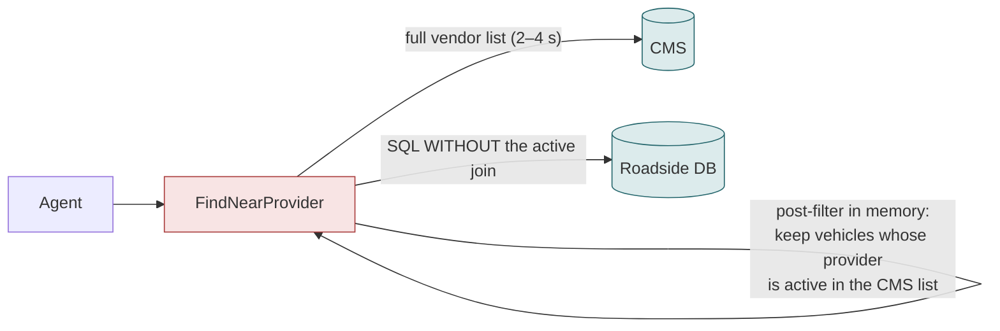
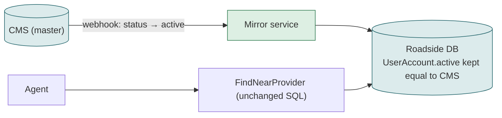

# F02 — Finding the nearest technicians (Auto-mode dispatch engine)

**Area:** Dispatching a job · **Verdict:** Must stay on Roadside · **Recommended:** keep the SQL; the mirror guarantees the Active flag is correct

> ### Quick view for managers
> **Verdict: Must stay on Roadside**
>
> **Why:** The nearest-technician search is one database query over vehicles, GPS positions, service types, provider grade and distance — none of which exist in the CMS. The only CMS-owned input is the provider's Active flag, and the sync keeps that correct. Nothing to move; nothing lost.
>
> *Details, diagrams and the pros/cons of each option follow below.*

---

## 1. What it is

After an Auto-mode job is saved with the customer's location and service type, Roadside finds technician vehicles that are **ready**, **within range**, **offer that service** and belong to an **active provider**, computes distance and price per vehicle, shows them on the map, and lets the agent push the job to one. It is the core of Auto mode.

## 2. Who uses it and how often

Every Auto-mode job save and every "find again" click: 8,338 Auto jobs in 90 days ≈ 90 per day, 82 distinct providers received work. Each run scans ~1,000 vehicles.

## 3. Today

### 3.1 Architecture

### 3.2 Workflow

### 3.3 Data used and where it can only come from

| Data | Source | Could the CMS supply it? |
|---|---|---|
| Vehicle position, ready state, push token | Roadside `Vehicle` | No — the CMS has no concept of vehicles |
| Service types per vehicle | Roadside `VehService` | No |
| Provider **active** gate | Roadside `UserAccount.active` inside the JOIN | Only by fetching the CMS list and post-filtering in memory |
| Provider name / group / phone for pins | Roadside `UserAccount` (map markers overlay CMS separately) | Yes (display only) |
| Grade | Roadside `Provider` | No |
| Distance | SQL function on Roadside | No |
| Previous offers (VehJob) | Roadside | No |

Note: this query does **not** check `isProviderMobile`. The mobile gate lives only in the search box (F01). A provider with tracked vehicles is found here whatever the flag says.

## 4. Option A — literal CMS-only

- Adds 2–4 s to every dispatch; on CMS failure the agent gets **no candidates** — the job cannot be dispatched in Auto mode at all.
- Duplicates a gate that already exists in SQL; two places to keep consistent.
- Vehicles, positions, services, grades, distance still come from Roadside — so the provider record still exists; only its Active flag moved.

| Pros | Cons |
|---|---|
| Active status is CMS-fresh at dispatch time | Slower dispatch; hard dependency on CMS for the most time-critical action in the system |
| | The record must still exist for everything else in the query |

## 5. Option C — CMS-master, mirror (recommended)

Nothing changes in the engine. The Active flag it reads is now guaranteed to equal the CMS status (webhook + nightly reconcile).

| Pros | Cons |
|---|---|
| Zero change to the most sensitive code path | Active is seconds behind the CMS, not live |
| Dispatch works during CMS outages | |
| One gate, in the place it already is | |

## 6. Verdict

**Must stay on Roadside.** The query needs vehicles, GPS, services, grade and distance — none of which the CMS has — and the Active gate belongs beside them. Under CMS-master the only change is that the sync keeps `active` correct.

**Code:** `BkkRsa.Web/AppCode/Db/Extension/JobInfoExtension.cs:28-150`, `BkkRsa.Core/AppCode/Models/NearProviderModel.cs:56-175` (four query variants), pins `Scripts/rsa/BkkRsa.NearProvider.js`.
