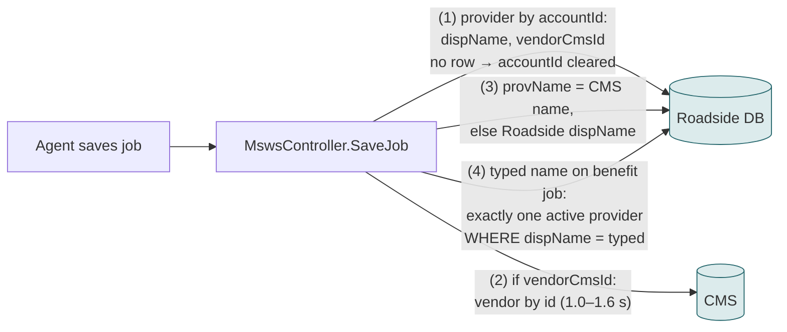
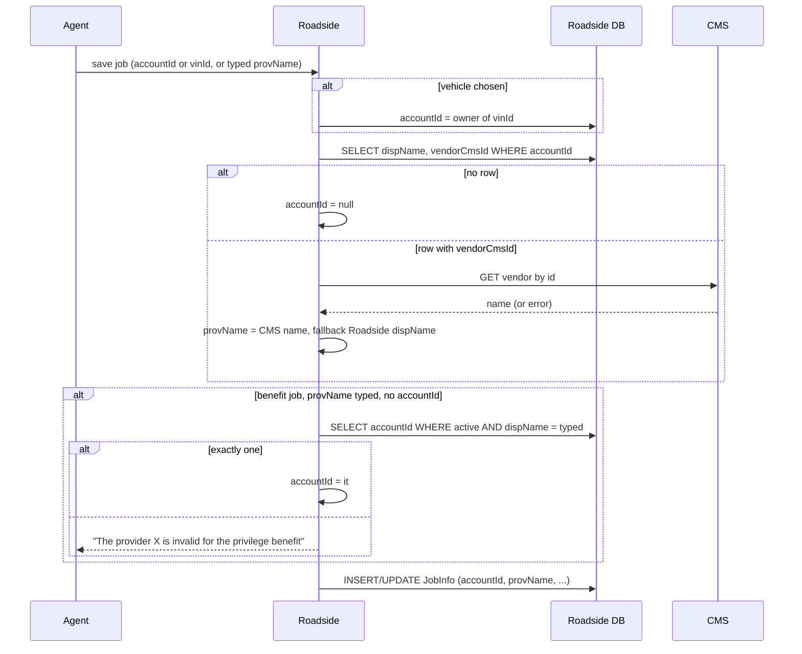
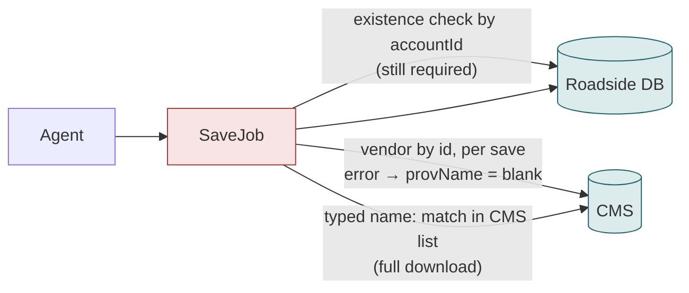
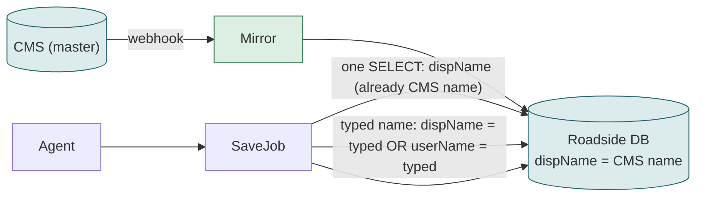

# F03 — Saving the job with the chosen provider (and hand-typed provider names)

**Area:** Dispatching a job · **Verdict:** Can move, with conditions · **Recommended:** name from the mirror; never save a blank

> ### Quick view for managers
> **Verdict: Can move, with conditions**
>
> **Conditions to move** — all of these must be true first:
> 1. The provider name stamped on a job must never be blank — so on a CMS error the Roadside name (or the mirror) is used, never an empty value.
> 2. Hand-typed provider names on Honda / Mercedes benefit jobs must match the CMS spelling — or the option to type a name is removed now that the search box offers every vendor.
> 3. The provider record must still exist in Roadside: the job stores the Roadside ID.
>
> **What we get:** Job records carry the CMS name from the moment of save; no extra CMS call per save if the mirror is used.
>
> *Details, diagrams and the pros/cons of each option follow below.*

---

## 1. What it is

When a job is saved with a provider — picked in the search box, or implied by the vehicle the agent dispatched to — Roadside writes the provider's **name** onto the job (`JobInfo.provName`) next to the provider **ID** (`JobInfo.accountId`). That stamped name is what the monitor board, the customer link and every report show for that job, forever.

A second path: on Honda / Mercedes benefit jobs an agent may **type** a provider name without picking one. Roadside then resolves the typed text to a provider ID by exact name match.

## 2. Who uses it and how often

Every job save ≈ 150 per day, plus re-saves. One CMS call per save today.

## 3. Today

### 3.1 Architecture

### 3.2 Workflow

### 3.3 Data used

| Field | Source | Purpose |
|---|---|---|
| accountId | Roadside | durable link job → provider |
| provName | CMS name (fallback Roadside) | historical display name on the job |
| dispName exact match | Roadside | resolve hand-typed name |
| BenefitVendorId | Roadside | see F04 |

## 4. Option A — literal CMS-only

| Situation | Result |
|---|---|
| Normal save | +1.0–1.6 s; name = CMS name ✔ |
| CMS error / 429 | job saved with **blank provider name**; blank on monitor board, customer link, reports until re-saved ✘ |
| Vendor unpublished | same as error ✘ |
| Typed name in Roadside spelling | rejected; agent must know the CMS spelling ✘ |
| Typed name on a benefit job | needs a full list download per save (2–4 s) |

| Pros | Cons |
|---|---|
| Name always CMS-current at save time | Blank names become possible on the permanent job record |
| | Slower save; typed names harder |

## 5. Option C — mirror (recommended)

| Pros | Cons |
|---|---|
| 0 CMS calls per save; save is faster than today | Name is webhook-fresh, not live (a rename published 3 s before the save may stamp the old name) |
| Never a blank name | |
| Typed names match CMS spelling *and* login | |

## 6. Comparison

| | Today | A · CMS-only | C · Mirror |
|---|---|---|---|
| CMS calls per save | 1 | 1 (+1 list if typed) | 0 |
| Blank name possible | no | **yes** | no |
| Typed-name matching | Roadside spelling | CMS spelling only | both |
| Save latency added | ~1–1.5 s | ~1–1.5 s (+2–4 s typed) | 0 |

## 7. Verdict

**Can move, with conditions.** Recommended **C**. Whatever is chosen, the stamped `provName` must never be written blank — it is the historical record reports fall back to when a vendor no longer exists.

**Decision:** whether hand-typed provider names on benefit jobs remain allowed at all now that the search box can offer every vendor.
**Code:** `BkkRsa/Api/MswsController.cs:363-382, 977-989, 1027-1046`; `MswsController_JobOthers.cs:269-288 (ResolveProviderDispNameAsync)`.
