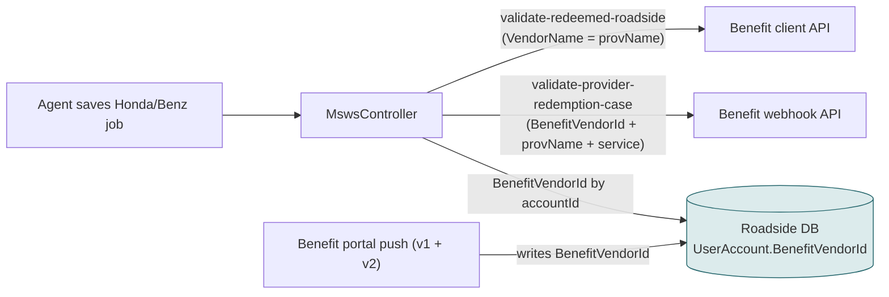
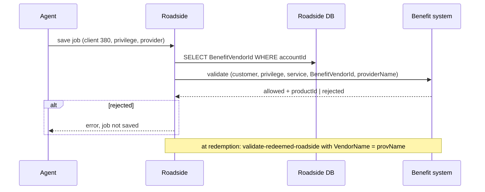
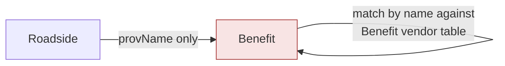
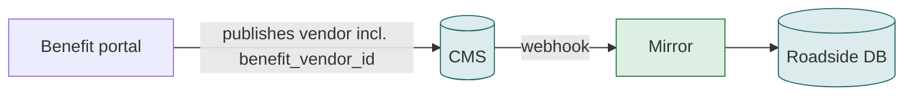

# F04 — Honda / Mercedes benefit check when saving or redeeming a job

**Area:** Dispatching a job · **Verdict:** Must stay on Roadside (or the CMS must carry the Benefit vendor ID) · **Recommended:** keep the ID on the Roadside record via the sync

> ### Quick view for managers
> **Verdict: Must stay on Roadside**
>
> **Why:** The Benefit system checks the provider by a Benefit vendor ID stored on the Roadside record (an earlier fix replaced fragile name matching). That ID is not in the CMS. Either it keeps arriving from the Benefit portal, or the CMS content model is extended to carry it — a Benefit-side decision.
>
> *Details, diagrams and the pros/cons of each option follow below.*

---

## 1. What it is

For Honda (client 380) and Mercedes (client 338) jobs, Roadside asks the Benefit system two questions: *is this provider allowed for this customer's privilege?* (at save) and *record the redemption against this provider* (at redemption). Both identify the provider.

## 2. Who uses it and how often

Every Honda / Mercedes job save and redemption; a large share of Auto-mode work.

## 3. Today

### 3.1 Architecture

### 3.2 Workflow

### 3.3 Why the ID matters

Until an earlier fix, the Benefit side matched the provider **by name**, and failed whenever the CMS and Roadside spelled a vendor differently (which, as this audit shows, is common). The fix made the Benefit portal push its own vendor primary key (`BenefitVendorId`) into the Roadside record and the check match on that.

## 4. Option A — literal CMS-only

`BenefitVendorId` is not a CMS field. If the Roadside record stops being written by the sync, the ID is gone and the check reverts to name matching:

| Pros | Cons |
|---|---|
| none specific | Reintroduces the name-mismatch failures the earlier fix removed |
| | Silent wrong matches when two vendors share a name |

## 5. Option C1 — keep the ID on the Roadside record (recommended, minimal)

The Benefit portal continues to push `BenefitVendorId` (one field) on save; the mirror never touches it. Everything else comes from the CMS.

| Pros | Cons |
|---|---|
| Zero change to a working check | One field still travels portal → Roadside outside the CMS path; two triggers to keep alive |

## 6. Option C2 — publish the Benefit vendor ID into the CMS

Add `benefit_vendor_id` to the CMS roadside module; the portal writes it on publish; the mirror copies it like any other field.

| Pros | Cons |
|---|---|
| Single path for every field; the CMS is fully the master | CMS content-model change + Benefit portal change; existing 700+ vendors need a backfill |

## 7. Verdict

**Must stay on Roadside** as a stored field. Choose C1 now, C2 if the Benefit side agrees to own it in the CMS (see `08`, complication 1).

**Code:** `BkkRsa/Api/MswsController.cs:398-406, 760-772`; `BenefitServices/JobRedeemption/JobRedeemptionHelper.cs:31-37`; sync writes at `ProviderSyncBenefitController.cs:522, 549`.
