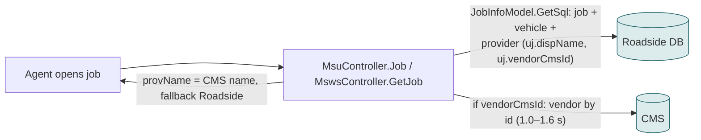
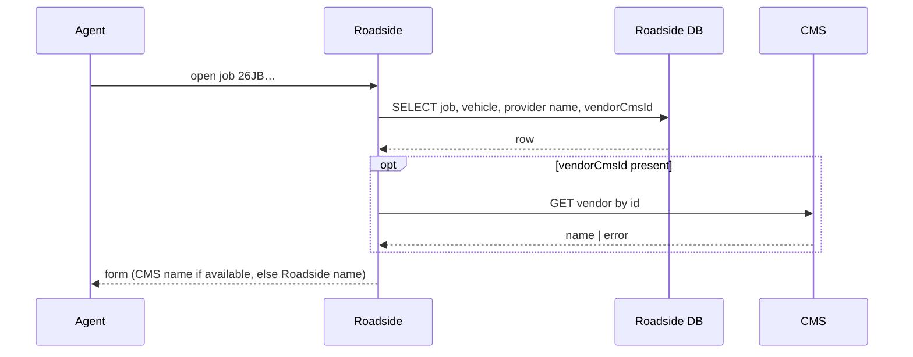
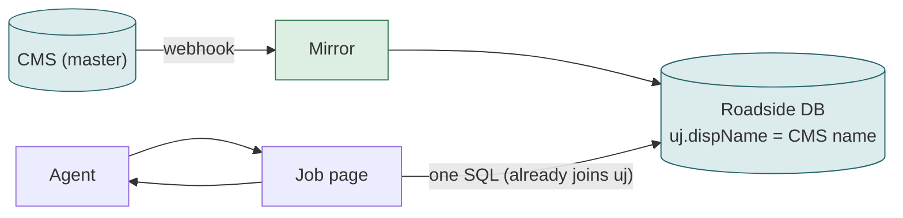

# F05 — Job detail page (the job form for an existing job)

**Area:** Job screens · **Verdict:** Can move, with conditions · **Recommended:** name from the mirror

> ### Quick view for managers
> **Verdict: Can move, with conditions**
>
> **Conditions to move** — all of these must be true first:
> 1. A rule for unpublished / draft vendors — the page must show the last known name, not a blank, when a vendor is taken down mid-job.
> 2. Read the name from the Roadside copy (0 CMS calls) or through a cache; not a 1–1.5 s CMS call on every open of the busiest page.
> 3. On CMS failure the page still shows a provider name.
>
> **What we get:** Job page opens ~1 s faster than today; name always equals the CMS name.
>
> *Details, diagrams and the pros/cons of each option follow below.*

---

## 1. What it is

The page an agent opens for one job: customer, vehicle, service, timestamps and the assigned provider's name. Opened many times over a job's life by several agents.

## 2. Volume

Several thousand opens per day (every job is opened repeatedly). One CMS call per open today when the provider is CMS-linked.

## 3. Today

## 4. Option A — literal CMS-only

Same as today minus the fallback.

| Situation | Result |
|---|---|
| Normal open | +1.0–1.6 s |
| CMS error / 429 | provider name **blank** on an open job |
| Vendor unpublished mid-job | provider name blank although a technician is en route |
| Thousands of opens per day | thousands of CMS calls per day, one per open |

| Pros | Cons |
|---|---|
| Name is live | Blanks on live jobs; slower open; CMS dependency on the busiest page |

## 5. Option B — cache

Per-open lookup hits the in-memory cache; ms; unpublished vendors still blank unless the cache keeps last-known values.

## 6. Option C — mirror (recommended)

The existing query already joins the provider record; the overlay call is simply removed once the mirror carries the CMS name.

| Pros | Cons |
|---|---|
| 0 CMS calls; page opens ~1 s faster than today | Name is webhook-fresh, not live |
| No blanks; unpublished → still shows the last mirrored name (record is set inactive, not erased) | |

## 7. Comparison

| | Today | A | B | C |
|---|---|---|---|---|
| CMS calls per open | 1 | 1 | 0 (hit) | 0 |
| Added latency | ~1–1.5 s | ~1–1.5 s | ms | 0 |
| Blank on CMS failure | no | **yes** | no | no |
| Blank when vendor unpublished | no | **yes** | depends | no |

## 8. Verdict

**Can move, with conditions.** Recommended **C**. The rule for unpublished vendors (`08`, complication 3) must exist before A or B.

**Code:** `BkkRsa/Controllers/MsuController.cs:202-222`; `BkkRsa/Api/MswsController.cs:1128-1136`; `BkkRsa.Core/AppCode/Models/JobInfoModel.cs:137-198`.
