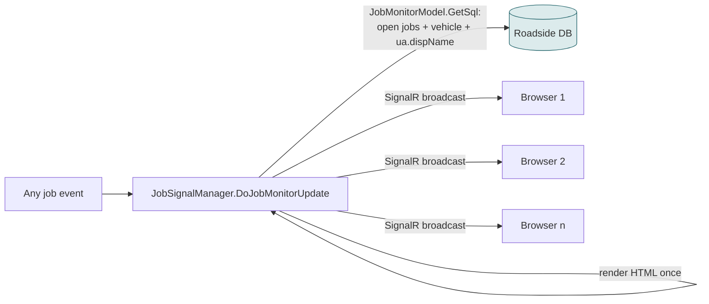
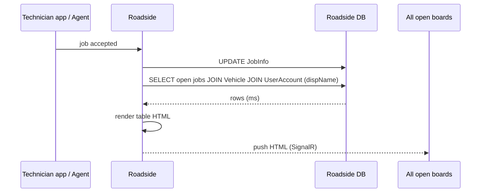
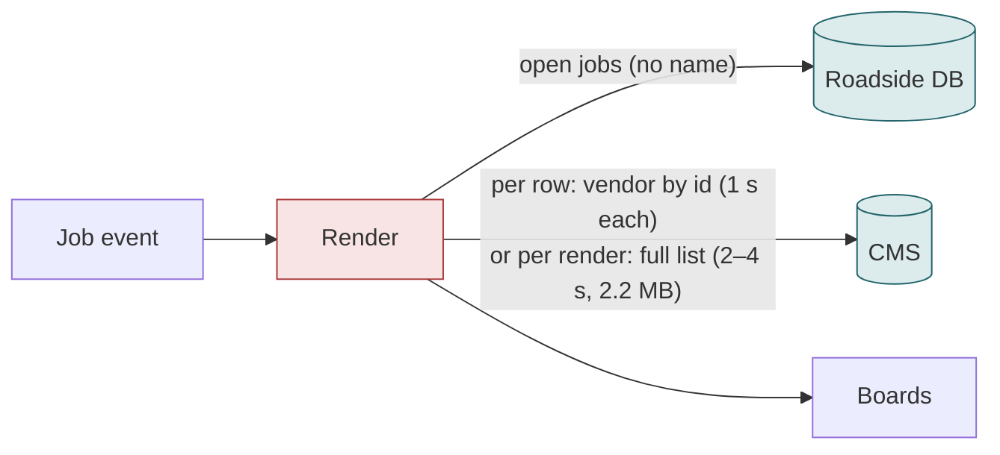
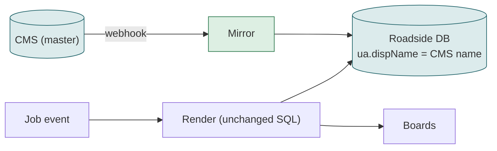

# F06 — Live job monitor board

**Area:** Job screens · **Verdict:** Must stay on Roadside · **Recommended:** mirror carries the CMS name inside the existing SQL

> ### Quick view for managers
> **Verdict: Must stay on Roadside**
>
> **Why:** The board re-renders on every job event and is pushed live to every screen. Names must come from the database the render already reads; a CMS call per event would put the board minutes behind and gigabytes per hour on the CMS. The sync keeps the stored name equal to the CMS name.
>
> *Details, diagrams and the pros/cons of each option follow below.*

---

## 1. What it is

A wall-board page listing every open job with status, vehicle and provider name. It is not refreshed by the user: whenever any job changes, the server re-renders the whole board and **pushes** the HTML to every open browser over SignalR.

## 2. Volume

One re-render per job event — save, accept, reach, complete, cancel, message — hundreds per hour in the day shift. Each render lists all open jobs (dozens to low hundreds).

## 3. Today

Provider data used: `ua.dispName` only, via SQL join.

## 4. Option A — literal CMS-only

The render happens inside the event handler. To get CMS names it must either call the CMS per row or download the list per render:

Arithmetic for one busy hour (300 events, 80 open jobs, 40 distinct providers):

| Approach | CMS calls / hour | Time per render | Traffic / hour |
|---|---|---|---|
| Per row | 300 × 80 = 24,000 | 80 × 1 s ≈ 80 s (board a minute behind after every event) | ~480 MB |
| Per render list | 300 | 2.4–4.3 s | 300 × 2.2 MB ≈ **660 MB** |
| Batched by provider | 300 × 1 = 300 | ~0.9 s | ~40 MB |

Any of these puts a third-party API in the path of a real-time push; a CMS hiccup stalls every board.

| Pros | Cons |
|---|---|
| Live CMS names | Board lags by seconds to minutes; hundreds of MB per hour; CMS outage freezes the board |

## 5. Option B — cache

Feasible: the render reads names from the in-memory cache (ms). But the cache becomes a hard dependency of the real-time path and must be warm at application start.

## 6. Option C — mirror (recommended)

| Pros | Cons |
|---|---|
| Zero change; ms renders; no CMS in the real-time path | Name is webhook-fresh |

## 7. Verdict

**Must stay on Roadside.** The name column must be in the database the render query already reads. Under CMS-master it will be the CMS name.

**Code:** `BkkRsa/Hubs/JobSignalManager.cs:77`; `BkkRsa.Core/AppCode/Model/JobMonitorModel.cs:62-105`; `Controllers/MsJobController.cs:127`, `MsuController.cs:933`.
