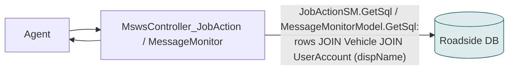
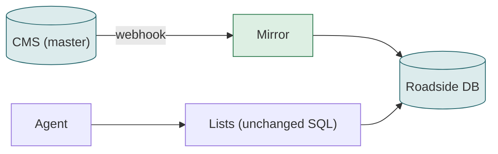

# F07 — Job action list and message monitor

**Area:** Job screens · **Verdict:** Can move, with conditions · **Recommended:** mirror

> ### Quick view for managers
> **Verdict: Can move, with conditions**
>
> **Conditions to move** — all of these must be true first:
> 1. Names read from the Roadside copy or a cache — never one CMS call per row (a 200-row page would take minutes).
>
> **What we get:** No visible change; names equal the CMS name.
>
> *Details, diagrams and the pros/cons of each option follow below.*

---

## 1. What it is

Two paged lists agents scroll: the **job action list** (events per job with the provider's name) and the **message monitor** (customer messages per job; provider column comes from the assigned vehicle).

## 2. Volume

Per page view; a page holds up to a few hundred rows; a few hundred views a day.

## 3. Today

Provider data: `provDispName = ua.dispName` via SQL join. No CMS.

## 4. Option A — literal CMS-only

Per page: 200 rows × 1 s per-row = **200 s**, or one list download 2.4–4.3 s per view, or batched by distinct provider (≈ 30 providers → 1 call ≈ 0.9 s). Per-row is not viable; per-view list is 2.2 MB per page turn.

| Pros | Cons |
|---|---|
| Live names | 2–4 s per page turn; blanks on CMS failure |

## 5. Option B — cache

Per view: names from memory, ms. Acceptable.

## 6. Option C — mirror (recommended)

No code change; the joined `dispName` is the CMS name once the mirror is complete.

## 7. Comparison

| | Today | A (list per view) | B | C |
|---|---|---|---|---|
| CMS calls per page | 0 | 1 | 0 (hit) | 0 |
| Added latency | 0 | 2.4–4.3 s | ms | 0 |
| Blank on CMS failure | no | yes | no | no |

## 8. Verdict

**Can move, with conditions** (cache or mirror). Recommended **C**.

**Code:** `BkkRsa/Api/MswsController_JobAction.cs:72`; `BkkRsa.Core/AppCode/Models/JobActionSM.cs:31-41`; `BkkRsa.Core/AppCode/Model/MessageMonitorModel.cs:32-48`.
