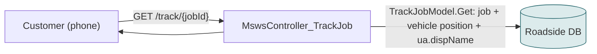
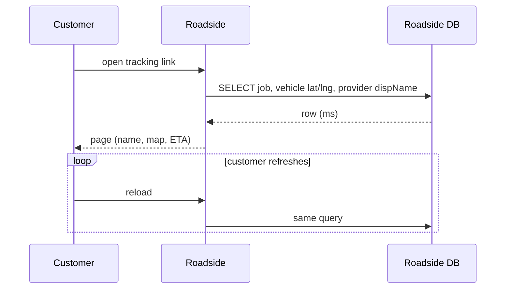
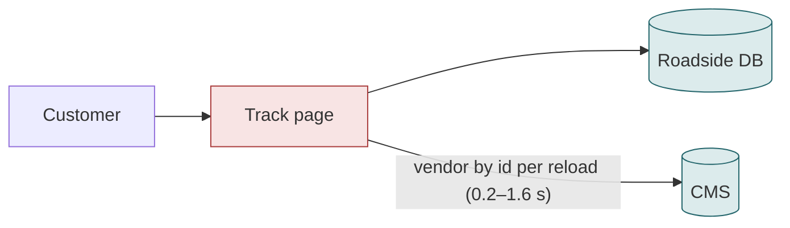
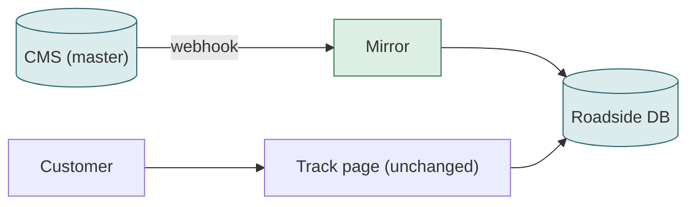

# F08 — Customer tracking link

**Area:** Job screens · **Verdict:** Can move, with conditions · **Recommended:** mirror (public page must not depend on the CMS)

> ### Quick view for managers
> **Verdict: Can move, with conditions**
>
> **Conditions to move** — all of these must be true first:
> 1. Name read from the Roadside copy — this is a public page customers reload while waiting at the roadside; it must not depend on a third-party API or show a blank company name.
>
> **What we get:** Customer sees the CMS spelling of the provider; page stays instant.
>
> *Details, diagrams and the pros/cons of each option follow below.*

---

## 1. What it is

The public page a customer opens from the SMS to watch the technician approach: a map, the vehicle, the ETA and the provider's company name.

## 2. Volume

Every customer click, usually several reloads per job while waiting; from mobile networks; **public, unauthenticated**.

## 3. Today

Provider data: `vinDispName = ua.dispName`.

## 4. Option A — literal CMS-only

| Situation | Result |
|---|---|
| Each customer reload | +0.2–1.6 s on a page reloaded by someone standing at the roadside |
| CMS error | company name blank on the page for the truck that is coming |
| Vendor unpublished mid-job | blank |
| Public page | a third-party API is now in the path of an unauthenticated, easily-reloaded page; a burst of reloads becomes a burst of CMS calls |

| Pros | Cons |
|---|---|
| Live name | Slower customer page; blank names; CMS exposed to public traffic patterns |

## 5. Option C — mirror (recommended)

| Pros | Cons |
|---|---|
| Instant; no third-party dependency on a public page; no blanks | Name webhook-fresh |

## 6. Verdict

**Can move, with conditions.** Recommended **C**; a cache is the minimum acceptable alternative.

**Code:** `BkkRsa/Api/MswsController_TrackJob.cs:43`; `BkkRsa.Core/AppCode/Models/TrackJobModel.cs:49-61`.
