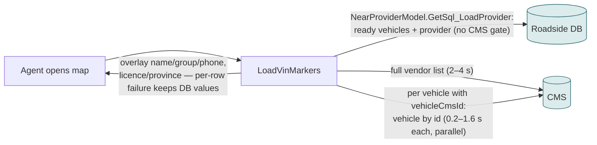
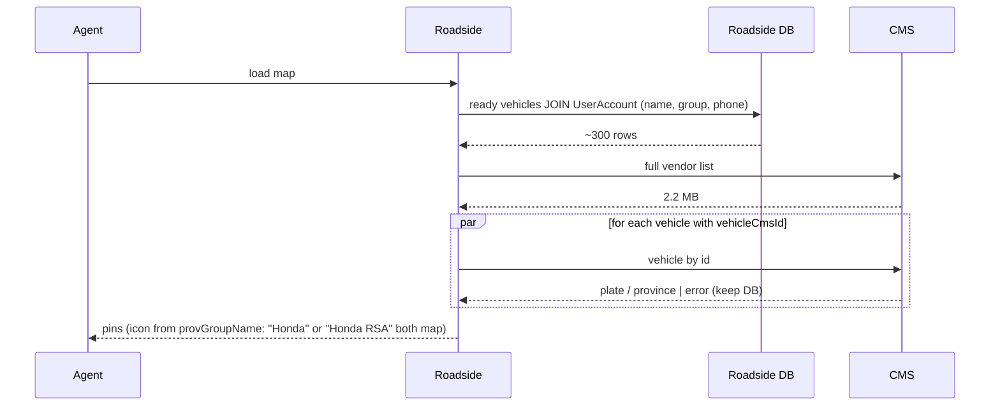
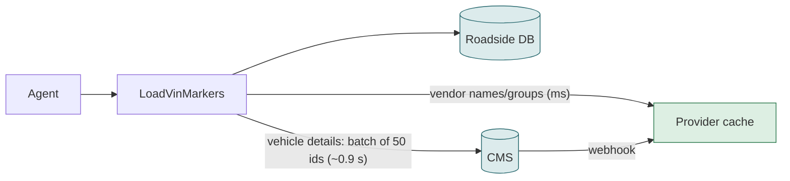

# F09 — Map markers (all technician vehicles)

**Area:** Job screens · **Verdict:** Can move, with conditions · **Recommended:** cache for vendor list + batched / mirrored vehicle data

> ### Quick view for managers
> **Verdict: Can move, with conditions**
>
> **Conditions to move** — all of these must be true first:
> 1. A cache for the vendor list (the map already downloads it on every load).
> 2. Vehicle details fetched in batches of 50 or mirrored into Roadside — today it is one CMS call per vehicle, hundreds per map load.
> 3. Group-icon rule keeps handling both spellings ("Honda" / "Honda RSA").
>
> **What we get:** Map loads in seconds instead of minutes of CMS time; pins never go blank.
>
> *Details, diagrams and the pros/cons of each option follow below.*

---

## 1. What it is

The dispatch map showing every ready technician vehicle as a pin, with provider name, group icon (Honda / Porsche pins), phone and licence plate. Used to eyeball coverage and to pick a vehicle by hand.

## 2. Volume

Every map load and refresh; ~1,000 vehicles, a few hundred ready at once. Today this is the **heaviest CMS consumer** in the system: one list download plus one CMS call per CMS-linked vehicle, per load.

## 3. Today

## 4. Option A — literal CMS-only

Remove the fallbacks: a failed vehicle call blanks that pin; a failed list download blanks every name; 300 ready vehicles = 300 CMS calls per load = 60–450 s of CMS time per load (parallelised today, but still hundreds of requests per click).

| Pros | Cons |
|---|---|
| Live | Hundreds of CMS calls per map load; blank pins on any error; throttling likely |

## 5. Option B — cache + batched lookups

300 vehicles → 6 batched calls ≈ 5 s, versus 300 calls today.

## 6. Option C — mirror vehicles too (recommended long-term)

Vehicle CMS fields (plate, province) are synced into `cloud.Vehicle` the same way provider fields are mirrored; the map becomes a single SQL query again, 0 CMS calls.

| Pros | Cons |
|---|---|
| Fastest; no CMS on the map path | Vehicle sync scope grows (vehicles are already pushed by the Benefit portal, so the plumbing exists) |

## 7. Comparison

| | Today | A | B | C |
|---|---|---|---|---|
| CMS calls per load (300 ready) | 1 + ~300 | 1 + ~300 | ~6 | 0 |
| Blank pins on CMS error | no | yes | no (cache) | no |
| Group icon | works for both spellings | same | same | same |

## 8. Verdict

**Can move, with conditions:** cache for the list, batched vehicle lookups now, vehicle mirror later.

**Code:** `BkkRsa/Api/MswsController_JobOthers.cs:290-380`; `NearProviderModel.GetSql_LoadProvider`; `Scripts/rsa/BkkRsa.NearProvider.js:13-30`.
