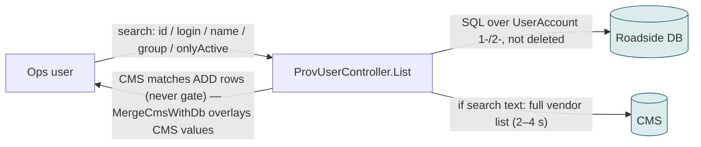
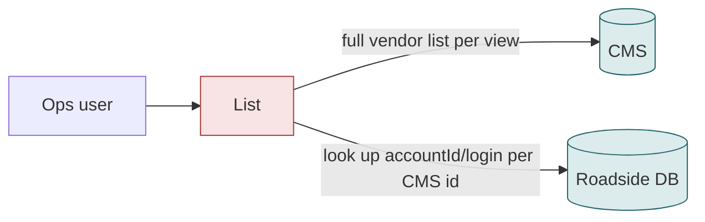
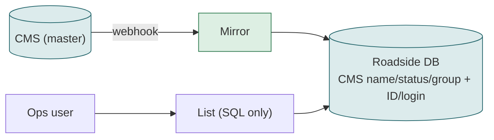

# F10 — Provider list (GAN → Provider)

**Area:** Managing providers · **Verdict:** Can move, with conditions · **Recommended:** mirror as the list source

> ### Quick view for managers
> **Verdict: Can move, with conditions**
>
> **Conditions to move** — all of these must be true first:
> 1. The Roadside copy is complete: the sync writes every CMS field (name, status, group, mobile, country, email) so the list shows CMS values without a 2–4 s CMS download per page.
> 2. The 31 providers the CMS does not recognise are resolved in the CMS (24 filed outside "Roadside Assistance", 7 with no CMS record) — otherwise they vanish from the list, which already happened once and was reverted.
> 3. Search still works on Roadside ID and login, not only CMS vendor name.
> 4. A rule for unpublished / draft vendors: shown as inactive, not missing.
>
> **What we get:** The list shows exactly what the Benefit team edited, instantly, with no missing providers.
>
> *Details, diagrams and the pros/cons of each option follow below.*

---

## 1. What it is

The searchable, paged list of providers: Roadside ID, login, display name, group, Active. Entry point to the provider detail page.

## 2. Volume

Per page view by the operations team; 719 active rows plus inactive / deleted.

## 3. Today

History: an earlier version gated the list on `vendorCmsId IN (CMS ids)` and the screen went blank for every provider the CMS did not return; it was changed to "add, never remove".

## 4. Option A — literal CMS-only

| Effect | Detail |
|---|---|
| 31 active providers disappear | 24 filed outside "Roadside Assistance" (5 towing companies among them), 7 with no CMS record |
| CMS-only vendors appear that Roadside cannot act on | vendors never synced: no ID, login or vehicles |
| Search by Roadside ID / login stops | CMS list is searchable by vendor name only |
| Paging / sorting over a 2.2 MB JSON per view | 2–4 s per view or a cache |

| Pros | Cons |
|---|---|
| The list *is* the CMS | Cannot show what the screen exists to show (Roadside identity); loses 31 |

## 5. Option C — mirror (recommended)

| Pros | Cons |
|---|---|
| Instant; complete; searchable by every field | Webhook-fresh |
| Shows CMS status and a "not in CMS" marker for the 7 unlinked rows | |

## 6. Verdict

**Can move, with conditions.** Recommended **C**. This screen manages *Roadside* providers; a list without Roadside ID and login does not do its job.

**Code:** `BkkRsa/Controllers/ProvUserController.cs:37, 69-143`; `BenefitCmsService.MergeCmsWithDb`.
