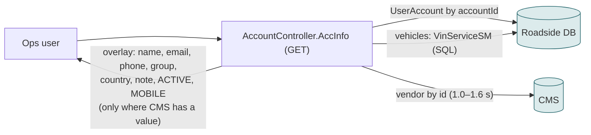

# F11 — Provider detail page

**Area:** Managing providers · **Verdict:** Already on the CMS · **Recommended:** keep; read via cache; vehicles stay Roadside

> ### Quick view for managers
> **Verdict: Already on the CMS**
>
> **Why:** This page already reads the CMS live for every field. Nothing to do; it is the preview of what the rest of the system would look like.
>
> *Details, diagrams and the pros/cons of each option follow below.*

---

## 1. What it is

One provider's login, display name, code, phone, group, email, note, **Active** and **Mobile Provider** flags, plus its vehicles. All fields read-only on screen; a Reset Password button remains.

## 2. Volume

Per open by the ops team; low.

## 3. Today

This page is why the drift went unnoticed: it shows the **CMS** Mobile flag as ticked while the search box (F01) uses the **Roadside** flag, which is 0.

## 4. Option A — literal CMS-only

Already CMS-first; removing the fallback means CMS failure / unpublished vendor → **empty form** (vehicles still listed).

| Pros | Cons |
|---|---|
| No change on a good day | Empty form on a bad day |

## 5. Option C — mirror + cache

Form reads the mirror (which now equals the CMS); an optional "live CMS" refresh button reads through the cache. Vehicles unchanged.

| Pros | Cons |
|---|---|
| Consistent with every other screen; never empty | Webhook-fresh |

## 6. Verdict

**Already on the CMS.** No user-visible change. Under CMS-master the screen and the search box finally agree.

**Code:** `BkkRsa/Api/AccountController.cs:162-310` (overlay 278-296); `Views/ProvUser/Edit.cshtml`.
