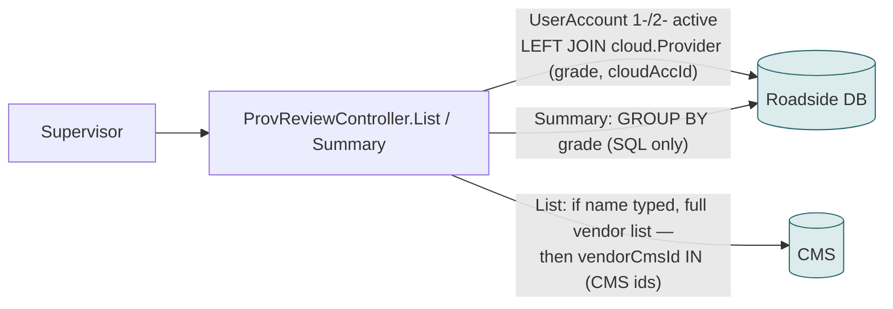
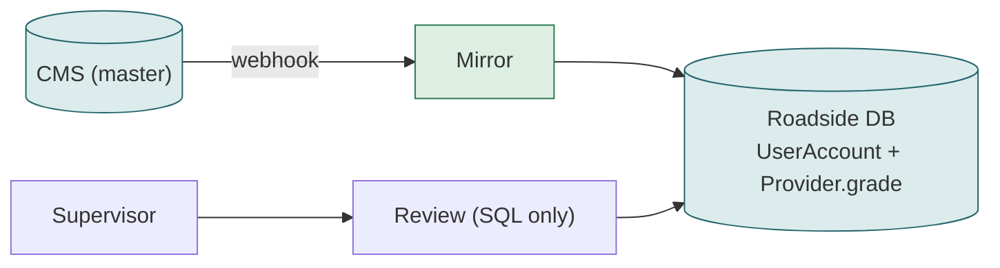

# F12 — Provider review and grades

**Area:** Managing providers · **Verdict:** Must stay on Roadside · **Recommended:** grades in Roadside; name search on the mirror

> ### Quick view for managers
> **Verdict: Must stay on Roadside**
>
> **Why:** Grades are a Roadside concept stored against the Roadside ID; the CMS has no grades and the per-grade summary is a database count. Only the name search could use CMS data.
>
> *Details, diagrams and the pros/cons of each option follow below.*

---

## 1. What it is

Supervisors assign a grade to each provider and review providers by grade; a summary shows how many providers hold each grade.

## 2. Today

Provider data: `dispName`, `userName`, `accountId` (Roadside), `grade` (Roadside `Provider` table keyed by `cloudAccId`).

## 3. Option A — literal CMS-only

- Grades are not CMS data; the join needs the Roadside ID. Only the name search could use the CMS.
- Summary `GROUP BY grade` cannot be computed from the CMS.
- Today's list already gates on the CMS when a name is typed → the 31 missing providers cannot be graded through the search.

| Pros | Cons |
|---|---|
| none | Grades must stay in Roadside regardless |

## 4. Option C — mirror

Name search on the mirror; CMS gate removed; grades untouched.

## 5. Verdict

**Must stay on Roadside** for grades. The name search moves to the mirror.

**Code:** `BkkRsa/Controllers/ProvReviewController.cs:39-62, 103-115`; `Views/ProvReview/*.cshtml`.
