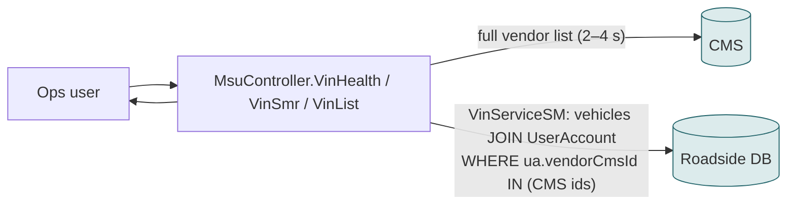

# F13 — Vehicle health / vehicle summary screens

**Area:** Managing providers · **Verdict:** Already on the CMS · **Recommended:** cache; fix the 31 in the CMS

> ### Quick view for managers
> **Verdict: Already on the CMS**
>
> **Why:** These screens already show only providers the CMS returns (which is why the 31 unrecognised vendors are already missing here). A cache removes the 2–4 s per view.
>
> *Details, diagrams and the pros/cons of each option follow below.*

---

## 1. What it is

Lists of technician vehicles grouped by provider: token / GPS health (VinHealth), service coverage (VinSmr), vehicle list per provider.

## 2. Today

Already gated on the CMS: providers not returned by the CMS list are not shown. The 31 are already missing here.

## 3. Option A — literal CMS-only

Same as today minus fallback: CMS failure → empty screen instead of an unfiltered list.

## 4. Option B/C — cache or mirror

Cache removes the 2–4 s per view. Mirror removes the CMS gate and shows every provider with a "not in CMS" marker.

| | Today | A | B | C |
|---|---|---|---|---|
| CMS calls per view | 1 | 1 | 0 (hit) | 0 |
| Shows the 31 | no | no | no | yes (marked) |

## 5. Verdict

**Already on the CMS.** Add the cache; resolve the 31 in the CMS data clean-up.

**Code:** `BkkRsa/Controllers/MsuController.cs:660, 751-763, 801-820`; `BkkRsa.Core/AppCode/Models/VinServiceSM.cs:45-60`.
