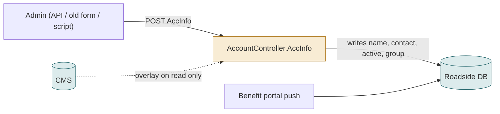
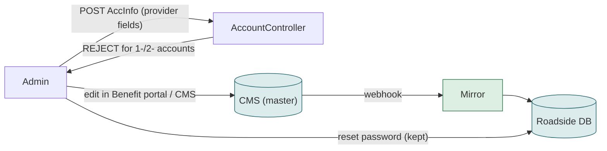

# F14 — Editing a provider directly in Roadside

**Area:** Managing providers · **Verdict:** Must be closed · **Recommended:** reject provider-field writes for `1-`/`2-` accounts; emergency path writes to the CMS

> ### Quick view for managers
> **Verdict: Must be closed**
>
> **Why:** The Roadside save API still lets an admin change a provider's name, contact or Active flag. With the CMS as master this path must be switched off for providers (kept for staff accounts and password reset), or the two systems drift apart again. An emergency-fix path, if wanted, must write to the CMS.
>
> *Details, diagrams and the pros/cons of each option follow below.*

---

## 1. What it is

Historically admins edited providers in Roadside. The edit screen has been made read-only, but the save API behind it (`AccInfo` POST, roles Administrators / ProviderAdmins) still accepts `email, mobile, active, note, dispName, userName, roles, provGroupName` for any account, including providers. Password reset is a separate API and stays.

## 2. Today

Two writers to the same record. Whichever ran last wins; the CMS is unaware.

## 3. Under CMS-master

## 4. Pros / cons of closing it

| Pros | Cons |
|---|---|
| One writer, one truth; the drift cannot come back this way | Urgent operational fixes (wrong phone at night) must go through the CMS and wait for publish + webhook |
| Audit trail lives in the CMS | If an emergency override is needed, it must write to the CMS (Management API), which is a small new feature |

## 5. What happens if it is *not* closed under "no fallback"

An admin fixes a phone number in Roadside. The next CMS publish overwrites it (fix lost), or no publish happens and Roadside disagrees with the CMS indefinitely — with no fallback logic left to paper over it.

## 6. Verdict

**Must be closed** for provider accounts before the switch-over (change 1). Keep it for staff (`3-`) accounts and keep password reset.

**Code:** `BkkRsa/Api/AccountController.cs:162-266 (save), 328 (ResetPwd)`; `Views/ProvUser/Edit.cshtml:178-187` (fields disabled client-side only).
