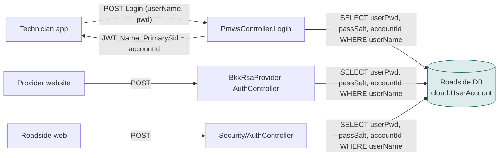
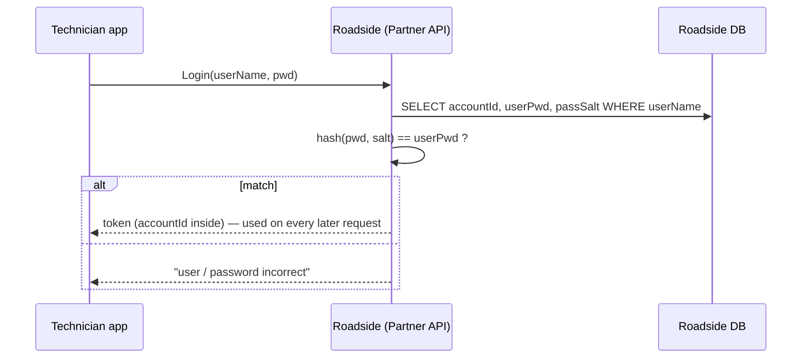
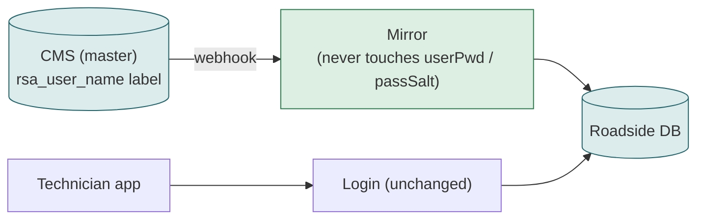

# F15 — Provider login (mobile app, provider website, Roadside web)

**Area:** Provider mobile app · **Verdict:** Must stay on Roadside · **Recommended:** no change

> ### Quick view for managers
> **Verdict: Must stay on Roadside**
>
> **Why:** Usernames, password hashes and login tokens live in Roadside. A content system cannot and must not hold credentials. Every provider keeps a Roadside record for as long as anyone from that provider can sign in.
>
> *Details, diagrams and the pros/cons of each option follow below.*

---

## 1. What it is

Technicians sign in to the Partner mobile app; providers sign in to the provider website; both use a username and password. Three login endpoints exist, all against the same Roadside record.

## 2. Volume

Every app session start and every token refresh; every provider on shift.

## 3. Today

Data used: `userName`, `userPwd`, `passSalt`, `accountId`. None exists in the CMS. The roadside module's `rsa_user_name` is a *label* copied to Roadside on sync; it is not a credential.

## 4. Option A — literal CMS-only

Not possible. A content management system must not hold password hashes, and Kontent has no authentication feature for end users. Even the username lookup would be a full-list download per login attempt.

| Pros | Cons |
|---|---|
| — | Cannot be built; would be a security anti-pattern if it could |

## 5. Under CMS-master

Unchanged. The CMS may own the *display* username label; Roadside owns the credential and the ID.

Rule for the mirror: **never** write `userName` if it would break an existing login (today's v2 already guards this: it only overwrites `userName` when the CMS sends a non-empty one).

## 6. Verdict

**Must stay on Roadside.** Every provider keeps a Roadside record for as long as anyone from that provider can sign in.

**Code:** `BkkRsaPartner/Api/PmwsController.cs:240-290, 608`; `BkkRsaProvider/Controllers/AuthController.cs:57-70`; `BkkRsa/Controllers/Security/AuthController.cs:63-85`; `BkkRsa.Core/AppCode/Db/UserAccount.cs:VerifyPassword`.
