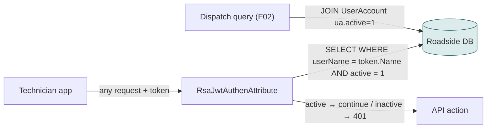
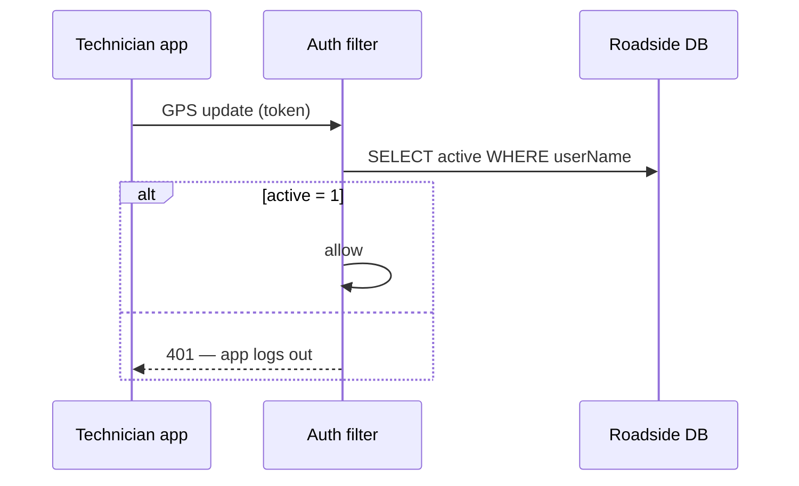
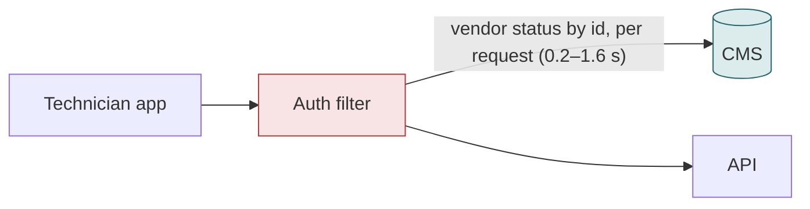
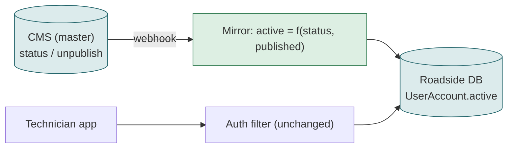

# F16 — Locking out a deactivated provider

**Area:** Provider mobile app · **Verdict:** Must stay on Roadside (flag), fed by the mirror · **Recommended:** sync CMS status → `active`; auth filter unchanged

> ### Quick view for managers
> **Verdict: Must stay on Roadside**
>
> **Why:** Every request from the technician app checks the provider's Active flag in Roadside — thousands of times an hour. Asking the CMS each time is not workable. The sync must copy CMS status into that flag; then deactivating a vendor in the CMS locks its technicians out within seconds. If this is forgotten, deactivating in the CMS does not stop the technicians.
>
> *Details, diagrams and the pros/cons of each option follow below.*

---

## 1. What it is

When a provider is deactivated, its technicians must stop receiving, accepting and updating jobs immediately, and its vehicles must stop being offered.

## 2. Volume

The check runs on **every authenticated API request** from the app (GPS updates every few seconds per vehicle, job polls, accepts): thousands of requests per hour.

## 3. Today

Deactivating the Roadside record blocks the app on the **very next request**.

## 4. Option A — literal CMS-only

| Effect | Detail |
|---|---|
| Thousands of CMS calls per hour on the hot path | Every GPS ping waits 0.2–1.6 s on the CMS |
| CMS outage | every technician is logged out (401) or, if "fail open", nobody can be locked out |
| Throttling | random 401s for active technicians |

| Pros | Cons |
|---|---|
| Deactivation in CMS is immediate | Not operable at this request rate; makes CMS availability = app availability |

## 5. Option B — cache

Per request: read status from the cache (ms). Lock-out latency = cache age (≤ 60 s or webhook). The auth filter now depends on a warm cache; background timers need the same.

## 6. Option C — mirror (recommended)

Lock-out latency = webhook latency (seconds). The filter and the dispatch join are untouched.

| Pros | Cons |
|---|---|
| Zero change to the hot path; works offline from the CMS | Seconds of delay after the CMS change |
| One flag drives app access and dispatch consistently | Requires the published/active mapping decision |

## 7. What breaks if this is forgotten

If "active" is treated as CMS-only for *reads* but the sync stops writing the Roadside flag, deactivating a vendor in the CMS **does not stop its technicians**: they keep receiving Auto-mode jobs (F02 reads the Roadside flag) and keep using the app (the filter reads the Roadside flag).

## 8. Verdict

**Must stay on Roadside** as the stored flag; the mirror must copy CMS status into it. Decision needed: which CMS states mean "inactive" (status inactive, unpublished, archived) — `08` complication 3.

**Code:** `BkkRsa.Web/BkkRsa.Web.Mvc/RsaJwtAuthenAttribute.cs:129`; `NearProviderModel.cs:74-75`; `RsaScheduler.cs:28-29`.
