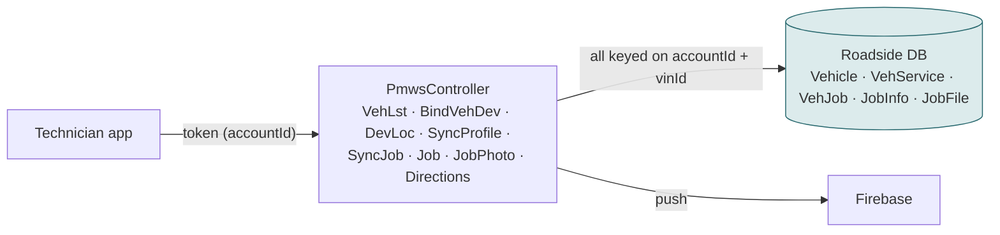

# F17 — Mobile app: vehicles, GPS, accepting and updating jobs

**Area:** Provider mobile app · **Verdict:** Unaffected · **Recommended:** no change (record must exist)

> ### Quick view for managers
> **Verdict: Unaffected**
>
> **Why:** Vehicles, GPS and job updates are tied to the provider's Roadside ID and never read provider details. No change — as long as the Roadside record exists.
>
> *Details, diagrams and the pros/cons of each option follow below.*

---

## 1. What it is

Everything a technician does after login: register / bind a vehicle to the phone, send position, receive a pushed job, accept, mark reached / complete, upload photos, get directions, sync profile and service types.

## 2. Today

Provider *details* are never read: the app shows job and customer data, and the vehicle's own data. The only provider dependency is the **ID** carried in the token and the **Active** gate in the auth filter (F16).

Production: 1,038 vehicles across 414 providers; 8,338 Auto-mode jobs in 90 days delivered through this path.

## 3. Under any option

No provider field is displayed or filtered here, so CMS-only vs mirror makes no difference — provided the Roadside record (and therefore the ID and the vehicles hanging off it) exists. Deleting the record would orphan every vehicle and job.

| | Effect |
|---|---|
| CMS-only reads | none |
| Record removed | all vehicles, jobs, photos of that provider orphaned — never do this |

## 4. Verdict

**Unaffected.** Confirms the structural point: the Roadside provider ID is the anchor for vehicles and jobs, not an optional cache.

**Code:** `BkkRsaPartner/Api/PmwsController.cs:297, 375, 474, 961, 1006, 1060, 1611, 2306, 3037`.
