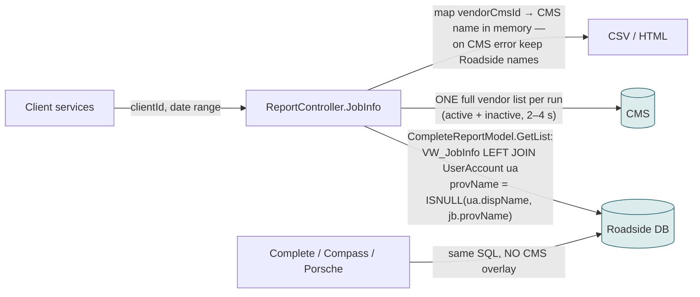
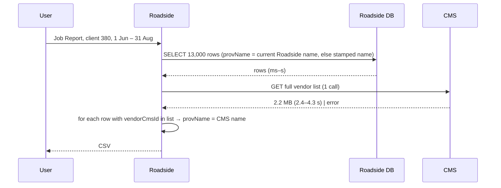
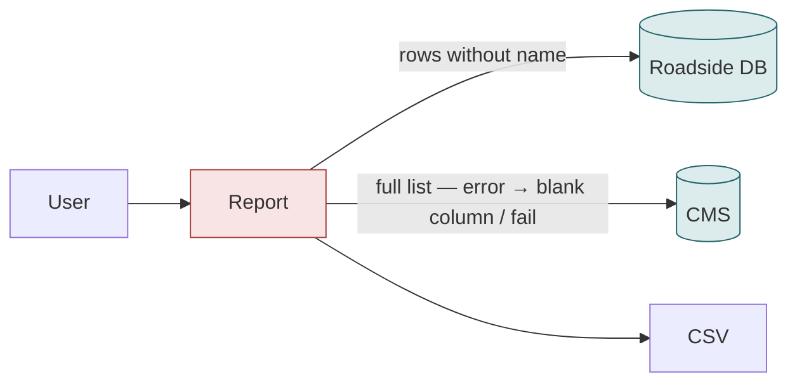
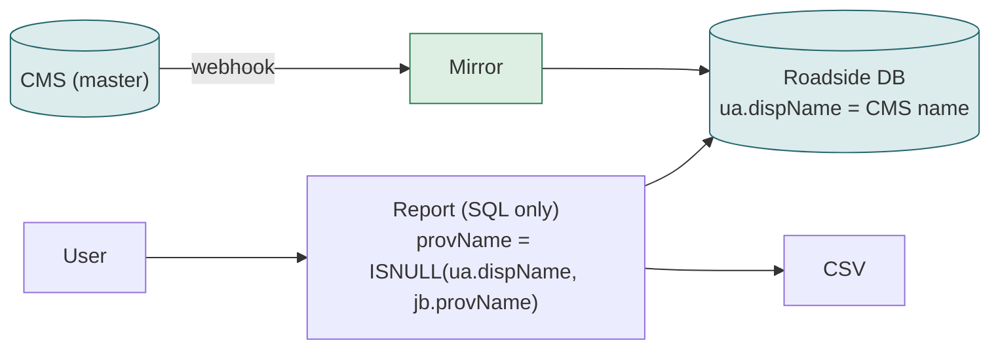

# F18 — Job Report, Complete Report, Compass Report, Porsche XLSX

**Area:** Reports · **Verdict:** Can move — but only one way · **Recommended:** mirror name in SQL, stamped name as last fallback, never per-row CMS calls

> ### Quick view for managers
> **Verdict: Can move — one way only**
>
> **Conditions to move** — all of these must be true first:
> 1. Never call the CMS per report row: a 3-month report is ~13,000 rows, which would take 3.5–6 hours and be throttled. One list call per run, a batched lookup by provider, or the Roadside copy are the only workable designs.
> 2. Keep the name stamped on each job as the last fallback, so vendors that are later unpublished or deleted still have a name on historical rows.
> 3. Decide whether a CMS outage may produce a report with a blank vendor column (today it falls back to Roadside names).
>
> **What we get:** All four reports print the same CMS name (today the Complete and Compass reports disagree with the Job Report after a rename).
>
> *Details, diagrams and the pros/cons of each option follow below.*

---

## 1. What they are

| Report | Used for | Rows |
|---|---|---|
| **Job Report** (CSV / HTML, `POST /report/jobinfo`) | main operational export per client and date range; Honda / Mercedes / Porsche billing and SLA | 1 per job, 55 columns |
| **Complete Report** (`/report/complete`) | month-end reconciliation of completed jobs | 1 per job |
| **Compass Report** (`/report/compass`) | insurance partner layout | 1 per job |
| **Porsche XLSX** (in progress) | Porsche monthly Excel | 1 per job |

In every one of them, exactly **one column** is provider-derived: the provider name.

## 2. Volume

51,764 jobs / year ≈ 4,300 / month. A 3-month Job Report ≈ **13,000 rows** touching ≈ **360 distinct providers**; a 12-month report ≈ 52,000 rows / ≈ 420 providers.

## 3. Today

Three sources of the name, in order: CMS name (if linked and in list) → current Roadside name → name stamped on the job at save time.

Inconsistency today: Job Report shows the CMS name; Complete and Compass show the Roadside name. After a rename they disagree.

## 4. The arithmetic (3-month report, 13,000 rows, 360 providers)

| Approach | CMS calls | CMS wall time | Downloaded | Throttling |
|---|---|---|---|---|
| **Per row** | 13,000 | 1.0–1.6 s each → **3.5–6 h** sequential; **10–18 min** at 20 parallel | ≈ 260 MB | certain (HTTP 429 mid-run → blank rows) |
| **Batched by distinct provider** (50 IDs/call) | 8 | ≈ 7 s | ≈ 1.2 MB | no |
| **One list per run** (today) | 1 | 2.4–4.3 s | 2.2 MB | no |
| **Mirror** (name already in the row) | 0 | 0 | 0 | n/a |

12-month report: per-row = **14–23 h**; the other three unchanged.

**Rule:** a report may make a handful of CMS calls per *run*, never per *row*.

## 5. Option A — literal CMS-only (list per run, no fallback)

| Situation | Result |
|---|---|
| Normal run | same as today |
| CMS error / 429 during run | **13,000 rows with a blank vendor column** sent to a client, or the report fails |
| Vendor unpublished / archived after doing jobs | blank name on all its historical rows (unless the stamped name is kept) |
| Per-row implementation by mistake | hours |

| Pros | Cons |
|---|---|
| CMS name, live | Client-facing exports can go out with no vendor names; history depends on vendors staying published |

## 6. Option C — mirror (recommended)

- 0 CMS calls; the overlay code is deleted from the Job Report; Complete / Compass / Porsche automatically agree.
- Unpublished vendor → mirror sets inactive but keeps the name → historical rows still named. Vendor deleted everywhere → stamped `jb.provName` still there.

| Pros | Cons |
|---|---|
| Fastest; consistent across all four reports; never blank | Name is webhook-fresh (irrelevant for a report run minutes or days later) |
| History survives vendor churn | |

## 7. A note on "name as it was" vs "name as it is now"

Both today's overlay and the mirror print the vendor's **current** name on old jobs. If the business ever wants the name *as it was at the time*, that is the stamped `jb.provName` — a separate reporting decision, unaffected by CMS-only.

## 8. Verdict

**Can move.** Recommended **C**. If the business insists on live CMS names, keep exactly the current design (one list per run) and keep the fallback; never per-row.

**Code:** `BkkRsa/Controllers/ReportController.cs:35 (Compass), 142 (Complete), 249-380 (JobInfo, overlay 311-341)`; `BkkRsa.Core/AppCode/Model/CompleteReportModel.cs:121-139`; `BkkRsa.Core/BkkRsa.Report/CompassReportModel.cs:81-85`, `JobReportModel.cs:51-59`.
