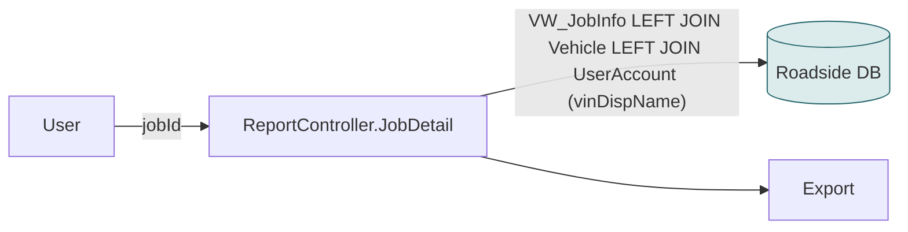

# F19 — Job Detail export

**Area:** Reports · **Verdict:** Can move, with conditions · **Recommended:** mirror name in SQL

> ### Quick view for managers
> **Verdict: Can move, with conditions**
>
> **Conditions to move** — all of these must be true first:
> 1. One CMS call per export at most, cached — this export is sometimes run in a loop over hundreds of jobs, which becomes the per-row case.
> 2. Preferably read the name from the Roadside copy (0 calls).
>
> **What we get:** No visible change.
>
> *Details, diagrams and the pros/cons of each option follow below.*

---

## 1. What it is

One job's full detail as an export (job, customer, vehicle, the vehicle's provider name, timestamps, locations). Some teams run it in a loop over a list of job IDs.

## 2. Today

No CMS. Provider name = `ua.dispName` of the vehicle's owner.

## 3. Option A — literal CMS-only

One job → one CMS call (0.2–1.6 s): affordable **per export**. In bulk (loop of 500 jobs) it is the per-row case: 500 calls, 2–13 minutes, throttling risk.

| Pros | Cons |
|---|---|
| Live name | Bulk use becomes slow / throttled; blank on error |

## 4. Option C — mirror (recommended)

Unchanged SQL; `ua.dispName` is the CMS name.

## 5. Verdict

**Can move, with conditions.** Recommended **C**. If a CMS call is added it must be one per export and cached.

**Code:** `BkkRsa/Controllers/ReportController.cs:488-530`.
