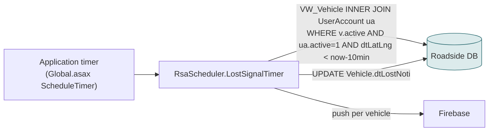
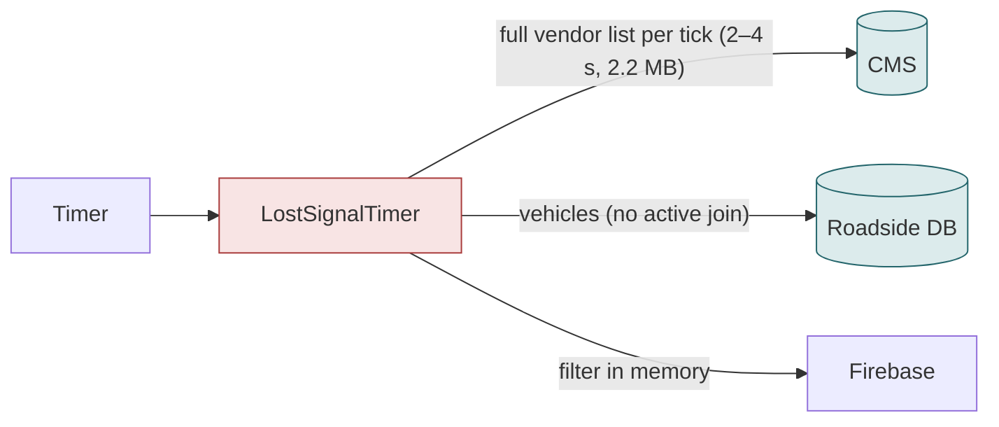
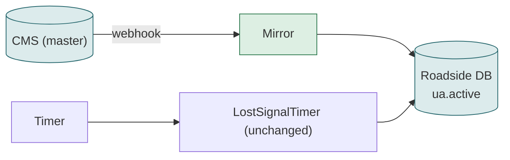

# F20 — Lost-signal alerts to technicians

**Area:** Background jobs · **Verdict:** Must stay on Roadside · **Recommended:** Active flag in the record, fed by the mirror

> ### Quick view for managers
> **Verdict: Must stay on Roadside**
>
> **Why:** A background timer checks vehicles of active providers for lost GPS every few minutes. It runs inside the database with no web request and cannot cheaply ask the CMS per tick. The sync keeps the Active flag correct.
>
> *Details, diagrams and the pros/cons of each option follow below.*

---

## 1. What it is

A timer inside the Roadside application checks, on a fixed schedule, for technician vehicles that are on shift, have a push token, belong to an **active** provider, and have not sent a GPS position for 10 minutes. It pushes a warning ("คำเตือน") to the vehicle and records when it did so.

## 2. Volume

Every timer tick (configured interval, minutes) for the life of the application; scans ~1,000 vehicles per tick.

## 3. Today

Provider data: `ua.active` inside the SQL join. Nothing else.

## 4. Option A — literal CMS-only

| Effect | Detail |
|---|---|
| A 2.2 MB download every tick, forever | e.g. every 5 min = 288 downloads / 630 MB per day for one boolean |
| CMS outage | alerts silently stop, or go to inactive providers' vehicles |
| Runs outside any web request | a web-request cache is not automatically available here |

| Pros | Cons |
|---|---|
| Active status CMS-fresh per tick | Wasteful; silent failure mode; needs its own CMS access path |

## 5. Option C — mirror (recommended)

## 6. Verdict

**Must stay on Roadside.** Same flag, same join; the mirror keeps it equal to the CMS.

**Code:** `BkkRsa/AppCode/BkkRsa/RsaScheduler.cs:23-86`; `Global.asax.cs:150, 233`.
