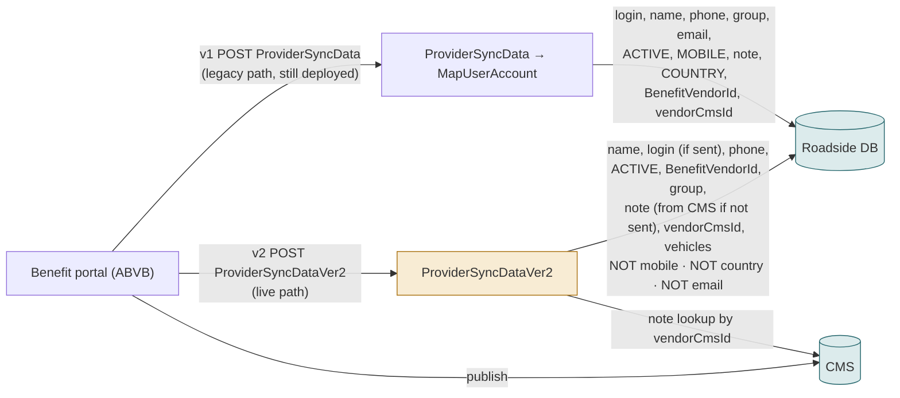
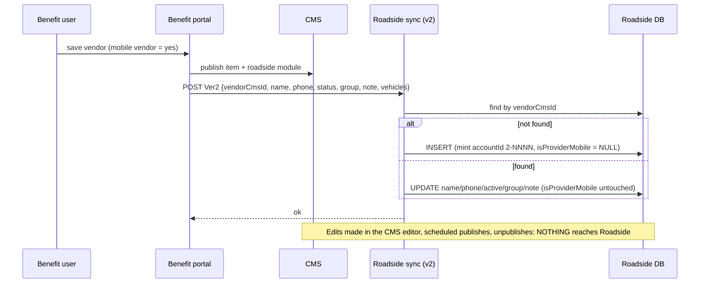
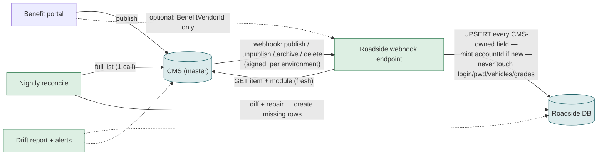
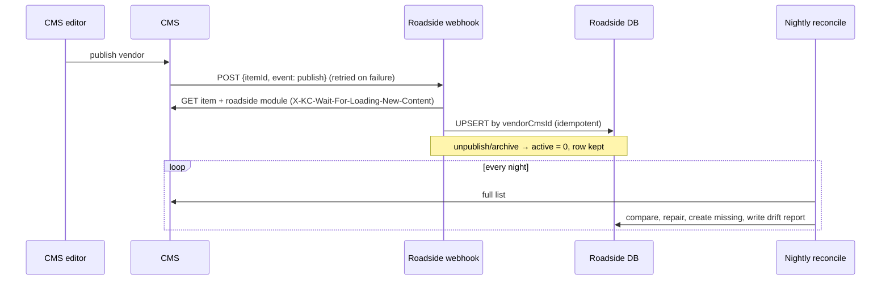

# F21 — The Benefit → Roadside sync (v1 and v2) → becomes the Mirror

**Area:** Background / integration · **Verdict:** Must keep running, and be fixed first · **Recommended:** complete v2 now; then CMS webhook + nightly reconcile

> ### Quick view for managers
> **Verdict: Must keep running — and be fixed first**
>
> **Why:** The sync is the only thing that creates a Roadside provider record, and seven features need that record. "CMS only" does not remove it; it changes its job from "copy some fields when the portal saves" to "keep a complete mirror whenever the CMS changes" (webhook + nightly reconcile). Today it drops the mobile flag, country and email — the cause of the 317 hidden providers.
>
> *Details, diagrams and the pros/cons of each option follow below.*

---

## 1. What it is

When a vendor is created or edited in the Benefit portal, the portal calls a Roadside endpoint that creates or updates the provider record and its vehicles. It is the *only* way a provider record comes into existence and the only thing that keeps Roadside's copy related to the CMS.

## 2. Today — two versions, two field sets

### Field mapping today

| CMS / portal field | v1 writes | v2 writes | Roadside column |
|---|---|---|---|
| Display name | ✔ | ✔ | dispName |
| RSA username | ✔ | ✔ (only if non-empty) | userName |
| Phone | ✔ | ✔ | mobile |
| Status | ✔ | ✔ | active |
| **Mobile vendor** | ✔ | **✘** | isProviderMobile |
| Group | ✔ | ✔ (ABE-5319) | provGroupName |
| Note | ✔ | ✔ (CMS fallback) | note |
| **Country** | ✔ | **✘** | countryCode |
| **Email** | ✔ | **✘** | email |
| Benefit vendor ID | ✔ | ✔ | BenefitVendorId |
| CMS link | ✔ | ✔ | vendorCmsId |
| Vehicles | separate endpoint | ✔ | Vehicle rows |

**Measured drift:** 317 active providers with CMS mobile = yes and Roadside flag 0/NULL (274 migrated, 40 updated by v2, 3 created by v2).

## 3. Why "CMS-only" does not remove the sync

Every feature marked *Must stay* (F02, F04, F06, F12, F15, F16, F20) needs the Roadside record, and the record is created here. "No fallback" changes what the sync is *for* (a mirror, not a partial push), not whether it exists.

## 4. Target — the Mirror

### Mapping under the mirror

| Field | Owner | Mirror behaviour |
|---|---|---|
| name, status→active, mobile, group, country, phone, email, note, roadside flag | CMS | always overwrite |
| userName | CMS label | overwrite only if non-empty **and** no existing login would break (today's guard) |
| accountId | Roadside | mint once, never change |
| userPwd, passSalt, vehicles, grades, jobs | Roadside | never touched |
| BenefitVendorId | Benefit portal | portal push (option C1) or CMS field (option C2), see F04 |

## 5. Options for the trigger

| | Portal push only (today) | CMS webhook | Webhook + nightly reconcile (recommended) |
|---|---|---|---|
| Catches CMS-editor edits | no | yes | yes |
| Catches scheduled publish / unpublish | no | yes | yes |
| Survives missed / duplicate webhooks | n/a | no | yes |
| Initial backfill tool | no | no | yes (same job) |
| New endpoint to secure | no | yes | yes |

## 6. Pros / cons of the mirror design

| Pros | Cons |
|---|---|
| One complete copy; every *Must stay* feature keeps working | New webhook endpoint, reconcile job and drift report to build and own |
| Drift becomes measurable and self-healing | Kontent webhooks fire per item: a bulk edit of 700 vendors = 700 calls (reconcile covers it) |
| Users get the single-source experience without CMS on the hot path | Publish → visible delay of seconds, not zero |

## 7. Verdict

**Must keep running, and be fixed first.** Phase 0 = add mobile / country / email to v2 (small, ships now). Phase 2 = webhook + reconcile + drift report; retire v1.

**Code:** `BkkRsa/Api/ProviderSyncBenefitController.cs:418-490 (v1), 494-570 (v2), 734-745 (MapUserAccount)`; ABVB `VendorService.cs:3146-3200 (v1 builder), 3204-3260 (v2 builder)`; `VendorServerless.Shared/Requests/ProviderRoadside.cs:27-42`.
