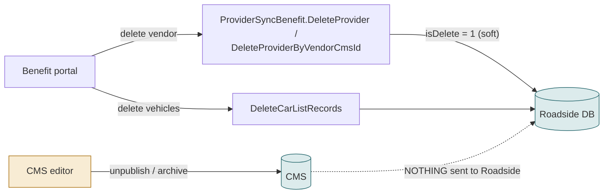
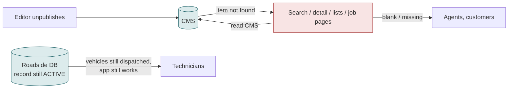
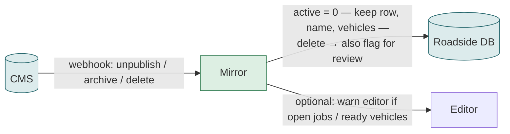

# F22 — Deleting, unpublishing and archiving a vendor

**Area:** Integration / data lifecycle · **Verdict:** Decision needed before any switch · **Recommended:** unpublish / archive / delete → inactive, never physical delete; stamped job names immutable

> ### Quick view for managers
> **Verdict: Decision needed**
>
> **Why:** What should Roadside do when a vendor is unpublished, archived or deleted in the CMS? Recommended: set inactive, keep the record and its history, never delete. Without this rule, an unpublished vendor becomes invisible to agents while its technicians keep receiving jobs.
>
> *Details, diagrams and the pros/cons of each option follow below.*

---

## 1. What it is

What Roadside does when a vendor stops existing, or stops being published, on the Benefit / CMS side.

## 2. Today

| Event | Roadside today |
|---|---|
| Vendor deleted in portal | record soft-deleted; vehicles deleted; jobs keep the ID and stamped name |
| Vendor status → inactive in portal | `active = 0` via sync |
| Vendor **unpublished** in CMS | nothing — record stays active; CMS reads return nothing for it (screens show Roadside values via fallback) |
| Vendor **archived** in CMS | same as unpublished |
| Vendor deleted directly in CMS | same as unpublished; the record is orphaned (`vendorCmsId` points nowhere) — 1 such active row exists today |

## 3. Under literal CMS-only (no fallback)

Result: the vendor is invisible to agents and customers but operationally alive. Its technicians keep getting Auto-mode jobs (F02 reads the Roadside flag); the job page shows a blank provider; the customer link shows a blank company; reports print blank for its history.

## 4. Under CMS-master (recommended rules)

| CMS event | Mirror action | Effect |
|---|---|---|
| status → inactive (published) | active = 0 | technicians locked out (F16), not offered (F01/F02), name still shown on history |
| unpublish / archive | active = 0, row kept | same |
| delete | active = 0, `vendorCmsId` kept, review flag | same; ops decides whether to purge later |
| re-publish | active = CMS status | back in service; same accountId, vehicles, logins |

Never physically delete a provider that has jobs, vehicles or logins. Never overwrite the name stamped on a job.

## 5. Pros / cons

| Rule | Pros | Cons |
|---|---|---|
| Unpublish → inactive | predictable; matches how ops thinks; technicians actually stop | editors must learn unpublish has operational effect (hence the warning) |
| Keep row on delete | history, reports, vehicles preserved; re-link possible | inactive rows accumulate (harmless) |
| Stamped name immutable | reports survive vendor churn | "current name on old jobs" is then a *choice* (F18 §7) |

## 6. Verdict

**Decision needed** (`08` complications 3 and 5), then implemented in the mirror (change 5). Without it, "no fallback" produces invisible-but-active vendors.

**Code:** `BkkRsa/Api/ProviderSyncBenefitController.cs:767, 994, 916, 955`; ABVB `VendorService.cs:3552, 3627`.
