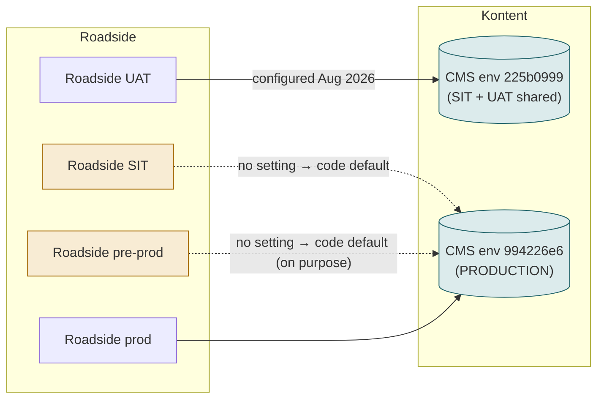
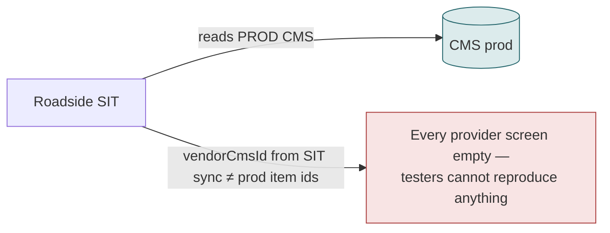
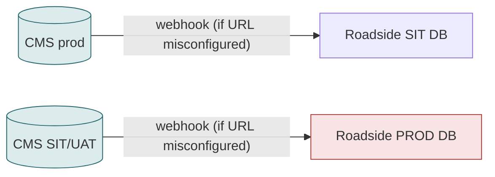
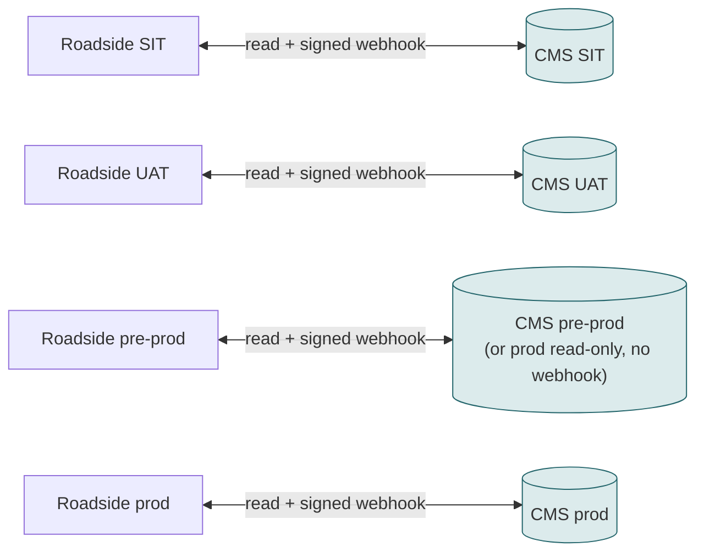

# F23 — Environments (SIT, UAT, pre-prod, production)

**Area:** Platform · **Verdict:** Fix first · **Recommended:** one CMS environment per Roadside environment, explicit config, webhooks locked per pair

> ### Quick view for managers
> **Verdict: Fix first**
>
> **Why:** SIT and pre-prod currently read the production CMS by default, and SIT/UAT share one CMS environment. Before the CMS becomes master, each Roadside environment needs its own CMS environment and its own webhook, or test edits can reach production data.
>
> *Details, diagrams and the pros/cons of each option follow below.*

---

## 1. What it is

Which CMS environment each Roadside environment reads (and, under CMS-master, which one is allowed to write to it).

## 2. Today

Facts: `KontentEnvironmentId` is unset on SIT and pre-prod, so `BenefitCmsService` falls back to the hard-coded production ID. SIT and UAT share one CMS environment. The four Roadside-authored content types (`vehicle_brand`, `vehicle_model`, `engine_system`, `defect_issue`) exist only in environments where they were hand-created.

## 3. Under literal CMS-only

## 4. Under CMS-master with webhooks — the real danger

A test publish rewriting production provider records is now a possible incident, not a confusing screen.

## 5. Target

Each Roadside site: explicit `KontentEnvironmentId`, its own webhook secret, content types replicated (the existing migration script does this).

## 6. Pros / cons

| Pros | Cons |
|---|---|
| Safe testing; reproducible bugs; no cross-environment writes | Kontent environment count and cost; content types and vendor test data must be replicated per environment |

## 7. Verdict

**Fix first** (change 13). Prerequisite for any CMS-master phase.

**Code / config:** `BenefitCmsService.cs:98, 374` (default env); `Web.config` `KontentEnvironmentId` per site; migration script `abe_kontent_env_migrate.py`.
